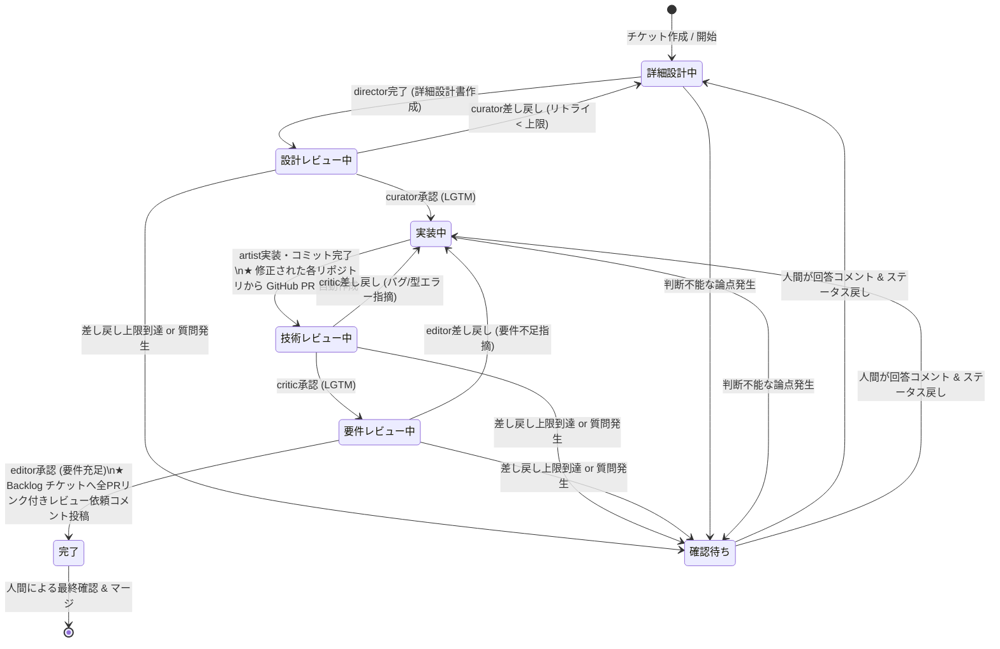

# aidevflow: Backlog-driven AI Agent Pipeline Daemon

Backlog のプロジェクト配下のチケット状態に応じて、人間の開発フローに沿った5つの専門 AI エージェント（**Antigravity CLI: `agy`**）をディスパッチする TypeScript 常駐デーモンです。

チケット詳細から複数リポジトリ（フロントエンド、バックエンド等）を自動検出し、起動ユーザーの **`~/aidevflow/`** 配下にリポジトリを自動 clone し、**`~/aidevflow/worktrees/<issueKey>/<repoName>/`** の階層で完全分離された worktree 環境を提供します。

実装完了後は **GitHub への自動 push & プルリクエスト（PR）作成** を各リポジトリごとに行い、全エージェントの検証完了後に **Backlog チケットへ PR リンク一覧付きのレビュー依頼コメント** を自動投稿します。

参考: [食べログ技術ブログ - 対話型をやめて1度の指示でPRができる。人間の開発フローに沿って5つの役割をリレーするAIエージェントパイプラインの設計](https://tech-blog.tabelog.com/entry/autonomous-ai-agent-pipeline-cost-verification_55)

---

## 📁 ワークスペース配置仕様（複数リポジトリ対応）

1つのチケットで複数リポジトリの改修があっても衝突しないよう、以下の階層で管理されます：

```
~/aidevflow/
├── repos/
│   ├── <repoA>/              # 自動 clone / fetch された元リポジトリ A
│   └── <repoB>/              # 自動 clone / fetch された元リポジトリ B
└── worktrees/
    └── <issueKey>/           # チケット専用ルートディレクトリ
        ├── <repoA>/          # リポジトリ A の worktree (ブランチ: issueKey)
        └── <repoB>/          # リポジトリ B の worktree (ブランチ: issueKey)
```

---

## 🚀 クイックスタート

### 1. 必要要件
- Node.js LTS (v24.x)
- pnpm (v11.x)
- `mise` (バージョン固定: `.mise.toml`)
- **Antigravity CLI (`agy`)** (デフォルトエージェントランナー)
- **GitHub CLI (`gh`)** (ログイン済み: `gh auth status` で確認)

### 2. 環境変数の設定
`.env.example` をコピーして `.env` を作成し、Backlog の API キーと監視対象プロジェクトキーを設定します。

```bash
cp .env.example .env
```

### 3. Backlog へのカスタム状態の一括追加（初回のみ）

エージェントパイプラインに必要なカスタム状態を Backlog プロジェクトへ一括追加します：

```bash
pnpm run setup:statuses
```

登録される状態：
- **詳細設計中** (`#3b9dbd` 水色) - 担当: Director
- **設計レビュー中** (`#868cb7` 青紫) - 担当: Curator
- **実装中** (`#eda62a` オレンジ) - 担当: Artist
- **技術レビュー中** (`#b0be3c` 黄緑) - 担当: Critic
- **要件レビュー中** (`#e07b9a` ピンク) - 担当: Editor
- **確認待ち** (`#f42858` 赤) - 人間介入・エスカレーション待ち

### 4. チケットの作成方法（複数リポジトリの指定）

Backlog で課題を作成する際、「詳細」に対象リポジトリ（単数または複数）を記載してください：

```markdown
リポジトリ:
- git@github.com:my-org/frontend.git
- git@github.com:my-org/backend.git

【要件】
ユーザー一覧APIを実装し、UI側のテーブルコンポーネントに結合する。
```

- デーモンは自動で各リポジトリを `~/aidevflow/repos/` にクローンし、`~/aidevflow/worktrees/STUDY-3/frontend` と `~/aidevflow/worktrees/STUDY-3/backend` を作成してエージェントが両リポジトリを修正できるようにします。

### 5. デーモンの起動

```bash
# 通常起動 (Antigravity CLI: agy を使用)
pnpm start

# モック起動 (Backlog連携テスト用)
AGENT_RUNNER=mock pnpm start
```

---

## 🔄 5つの専門エージェントと人間確認（エスカレーション）フロー



---

## 🛡️ 差し戻し無限ループ防止 & 人間エスカレーション仕様

### ① 差し戻し上限によるループ防止 (`MAX_REJECTION_COUNT`)
- レビュー差し戻しが設定値（デフォルト: `3` 回）に達すると、自律パイプラインを自動停止し、ステータスを **「確認待ち」** に変更します。
- レビューが承認（LGTM）された場合はカウンターが自動リセットされます。

### ② AI からの人間確認要請 (`【人間への確認依頼】`)
- エージェントがプロンプト内で仕様の曖昧さや判断不能な技術的課題を検知し、`【人間への確認依頼】` または `CONFIRM_HUMAN` を出力した場合、上限回数に達していなくても即座に **「確認待ち」** にエスカレーションします。

### ③ 人間による再開フロー (Resume)
1. 人間がチケットのコメントで指示・方針を回答します。
2. チケットのステータスを **「詳細設計中」** または **「実装中」** に戻します。
3. デーモンが「確認待ち」からの復帰を自動検知し、**差し戻しカウンターをゼロにリセット** して人間の最新コメントを最優先コンテキストとして自律作業を再開します。

---

## ⚙️ サンドボックス (Sandbox) 環境における pnpm 設定

本サンドボックス環境では、`/home/oharato/.local` が読み取り専用（`ro`）でマウントされているため、プロジェクトルートの [`.npmrc`](file:///home/oharato/workspace/aidevflow/.npmrc) に書き込み可能なパスを指定してパッケージを管理しています：

```ini
registry=https://npm.flatt.tech
store-dir=/tmp/.pnpm-store
cache-dir=/tmp/.pnpm-cache
state-dir=/tmp/.pnpm-state
```
