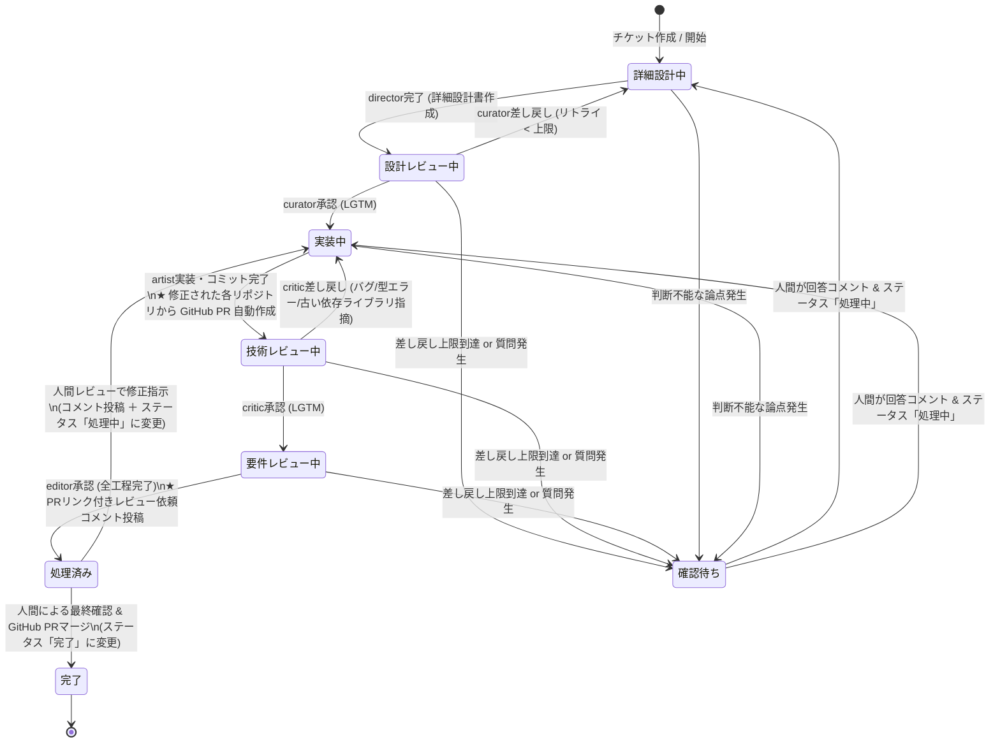

# aidevflow: Backlog-driven AI Agent Pipeline Daemon

Backlog のプロジェクト配下のチケット状態に応じて、人間の開発フローに沿った5つの専門 AI エージェント（**Antigravity CLI: `agy`**）をディスパッチする TypeScript 常駐デーモンです。

チケット詳細から複数リポジトリ（フロントエンド、バックエンド等）を自動検出し、起動ユーザーの **`~/aidevflow/`** 配下にリポジトリを自動 clone し、**`~/aidevflow/worktrees/<issueKey>/<repoName>/`** の階層で完全分離された worktree 環境を提供します。

実装完了後は **GitHub への自動 push & プルリクエスト（PR）作成** を各リポジトリごとに行い、全エージェントの検証完了後に **Backlog チケットへ PR リンク一覧付きのレビュー依頼コメント** を自動投稿します。

参考: [食べログ技術ブログ - 対話型をやめて1度の指示でPRができる。人間の開発フローに沿って5つの役割をリレーするAIエージェントパイプラインの設計](https://tech-blog.tabelog.com/entry/autonomous-ai-agent-pipeline-cost-verification_55)

---

## 📁 ワークスペース配置仕様（複数リポジトリ対応）

1つのチケットで複数リポジトリの改修があっても衝突しないよう、以下の階層で管理されます：

```
~/aidevflow/
├── repos/
│   ├── <repoA>/              # 自動 clone / fetch された元リポジトリ A
│   └── <repoB>/              # 自動 clone / fetch された元リポジトリ B
└── worktrees/
    └── <issueKey>/           # チケット専用ルートディレクトリ
        ├── <repoA>/          # リポジトリ A の worktree (ブランチ: issueKey)
        └── <repoB>/          # リポジトリ B の worktree (ブランチ: issueKey)
```

---

## 🚀 クイックスタート

### 1. 必要要件
- Node.js LTS (v24.x)
- pnpm (v11.x)
- `mise` (バージョン固定: `.mise.toml`)
- **Antigravity CLI (`agy`)** (デフォルトエージェントランナー)
- **GitHub CLI (`gh`)** (ログイン済み: `gh auth status` で確認)

### 2. 環境変数の設定
`.env.example` をコピーして `.env` を作成し、Backlog の API キーと監視対象プロジェクトキーを設定します。

```bash
cp .env.example .env
```

### 3. Backlog へのカスタム状態の一括追加（初回のみ）

エージェントパイプラインに必要なカスタム状態を Backlog プロジェクトへ一括追加します：

```bash
pnpm run setup:statuses
```

登録される状態：
- **詳細設計中** (`#3b9dbd` 水色) - 担当: Director (要件から詳細設計書を作成)
- **設計レビュー中** (`#868cb7` 青紫) - 担当: Curator (詳細設計書の客観的レビュー)
- **実装中** (`#eda62a` オレンジ) - 担当: Artist (コード実装、テスト、最新安定版の依存選定)
- **技術レビュー中** (`#b0be3c` 黄緑) - 担当: Critic (技術レビュー: 型/規約/バグ/言語・ライブラリの最新性点検)
- **要件レビュー中** (`#e07b9a` ピンク) - 担当: Editor (チケット要件の充足度レビュー)
- **確認待ち** (`#f42858` 赤) - 人間介入・エスカレーション待ち

> [!NOTE]
> **フリープラン等でカスタム状態の追加が制限されている場合（自動フォールバック）:**
> Backlog の個人・フリープラン等で「`Custom status is not available in this space's plan`」となる場合でも、**デーモンが起動時に自動検知して「件名プレフィックスモード」に自動フォールバック**します。
> 
> - **標準ステータス（4状態）**:
>   - **未対応**: AI開始前、または「確認待ち」（人間が見るべき状態）
>   - **処理中**: AIエージェントが自律リレー実行中
>   - **処理済み**: 全AI工程完了（人間によるPRレビュー・マージ待ち）
>   - **完了**: 人間がマージ完了
> - **件名プレフィックス（接頭辞）**:
>   - `[詳細設計中] チケット名`
>   - `[設計レビュー中] チケット名`
>   - `[実装中] チケット名`
>   - `[技術レビュー中] チケット名`
>   - `[要件レビュー中] チケット名`
>   - `[確認待ち] チケット名`（ステータスも「未対応」に自動変更）
>   - `[要件レビュー完了] チケット名`（ステータスも「処理済み」に自動変更）
> 
> 特別な設定変更は不要で、チケットを「処理中」にするだけで自動的に `[詳細設計中]` からリレーが始まります。カンバンや課題一覧でも現在のフェーズが一目で分かります。

### 4. チケットの作成方法（複数リポジトリの指定）

Backlog で課題を作成する際、「詳細」に対象リポジトリ（単数または複数）を記載してください：

```markdown
リポジトリ:
- git@github.com:my-org/frontend.git
- git@github.com:my-org/backend.git

【要件】
ユーザー一覧APIを実装し、UI側のテーブルコンポーネントに結合する。
```

- デーモンは自動で各リポジトリを `~/aidevflow/repos/` にクローンし、`~/aidevflow/worktrees/STUDY-3/frontend` と `~/aidevflow/worktrees/STUDY-3/backend` を作成してエージェントが両リポジトリを修正できるようにします。

### 5. ドラフト保護と通常チケットとの共存 (種別 / カテゴリ設定)

> [!TIP]
> **「書きかけのドラフトチケットが勝手に実行されないか？」**
> **「同じBacklogプロジェクトで人間が手作業で行う通常タスクと混ざらないか？」**
>
> `aidevflow` は以下の二重の安全機能により、ドラフトや無関係なタスクを誤って処理しないよう保護されています：
>
> 1. **ステータスによる保護（デフォルト）**:
>    - チケット作成直後のステータスは **「未対応」** であり、AIパイプラインは自動では開始されません。
>    - 要件や対象リポジトリの下書きが終わり、人間がチケットを **「処理中」**（または「詳細設計中」）に変更した段階で初めて自律実行がトリガーされます。
> 2. **種別・カテゴリー・タグによる対象の限定**:
>    - `.env` で以下のフィルタを設定することで、特定の条件に合致したチケットのみを監視・実行対象に絞り込むことができます：
>      ```bash
>      # 例: 種別が「AI開発」のチケットのみを対象にする
>      TARGET_ISSUE_TYPE=AI開発
>
>      # 例: カテゴリーが「AIパイプライン」のチケットのみを対象にする
>      TARGET_CATEGORY=AIパイプライン
>
>      # 例: 件名や本文に [AI] や #ai を含むチケットのみを対象にする
>      REQUIRE_AI_TAG=true
>      ```

### 6. 調査・リサーチタスクの実行方法（実装を伴わないパイプライン）

「コード実装ではなく、技術選定、比較検証、アーキテクチャ設計、スパイク（Spike）を行いたい」という場合、**設計（Director）と設計レビュー（Curator）のみで完了する「調査モード」** を利用できます。

#### 💡 調査タスクとして実行する方法（以下のいずれか1つでOK）
- **件名にタグを付ける**: `[調査] PostgreSQLのベクトル検索比較` や `【リサーチ】キャッシュ戦略の検討`、`[spike] ...`
- **チケット種別を「調査」にする**: Backlog の種別（issueType）に「調査」や「リサーチ」「Spike」を設定
- **カテゴリーを「調査」にする**: カテゴリーに「調査」や「リサーチ」を設定
- **本文に指定する**: チケット本文に `タスク種別: 調査` や `mode: spike` と記載

#### 🔄 調査パイプラインの流れ
1. **Director（調査・検討・設計）**:
   - チケットの論点や要件を整理し、技術検証や比較検討を実施。
   - マークダウン形式の調査報告書・設計書（`docs/investigation_report.md` または `docs/detailed_design.md`）を作成し、Git コミット。
   - 自動的に `[調査レビュー中]` へ遷移。
2. **Curator（調査レビュー）**:
   - 調査報告書の妥当性・論点の網羅性を客観的にレビュー。
   - 不足があれば `director` へ差し戻し（`[調査中]` へ戻る）。
   - 問題がなければ **承認（LGTM）** し、**コード実装（Artist）へは進まずに全工程完了！**
3. **完了・レビュー報告**:
   - ステータスが **「処理済み」**（件名: `[調査完了]`）に更新され、調査報告書の要約が Backlog コメントに投稿されます。
   - レビュー後に人間が追加指示をコメントしてステータスを「処理中」に戻すと、自動的に `director` が再起動して再調査を行います。

### 7. デーモンの起動方法（フォアグラウンド / バックグラウンド）

開発・デバッグ時の動作確認には **フォアグラウンド起動**、ターミナルを閉じて常駐稼働させるには **バックグラウンド起動** を使い分けることができます。

#### ① フォアグラウンド起動 (動作確認・デバッグ用)
標準出力を直接ターミナルで確認したい場合に最適です（`Ctrl + C` で停止）：

```bash
# 本番モード (Antigravity CLI: agy)
pnpm start

# モックモード (Backlog連携テスト用・LLM不使用)
AGENT_RUNNER=mock pnpm start
```

#### ② バックグラウンド常駐起動 (通常運用)
ターミナルを閉じてもバックグラウンドで動き続けるバックグラウンドモードです：

```bash
# バックグラウンド起動 (PID管理・ログ自動出力)
pnpm run start:bg

# 稼働ステータス確認
pnpm run status:bg

# リアルタイムログ監視 (tail -f)
pnpm run logs

# デーモンの安全停止
pnpm run stop:bg
```

#### ③ 本格的な常駐化 (systemd ユーザーサービス)
OS起動時の自動起動やクラッシュ時の自動再起動を行う場合は、`systemd --user` ユニットファイル（`~/.config/systemd/user/aidevflow.service`）を作成して管理できます：

```ini
# ~/.config/systemd/user/aidevflow.service
[Unit]
Description=aidevflow Backlog AI Agent Daemon
After=network.target

[Service]
Type=simple
WorkingDirectory=/home/oharato/workspace/aidevflow
ExecStart=/home/oharato/.local/share/mise/shims/node dist/index.js
Restart=always
RestartSec=10
EnvironmentFile=/home/oharato/workspace/aidevflow/.env

[Install]
WantedBy=default.target
```

```bash
systemctl --user daemon-reload
systemctl --user enable --now aidevflow
systemctl --user status aidevflow
journalctl --user -u aidevflow -f
```

> [!NOTE]
> **「モック起動 (Backlog連携テスト用)」とは？**
>
> `AGENT_RUNNER=mock` は、**実際のLLM（ClaudeやGemini等）を呼び出さず、数秒のダミー待機で各エージェントの処理結果をシミュレートする検証モード**です。
> - **メリット**: LLMのAPIトークン消費ゼロ、待ち時間数秒で動作検証が可能。
> - **検証できること**:
>   - Backlog APIキーの疎通、チケットのステータス自動変更、コメント投稿。
>   - リポジトリの自動 clone、ワークツリー作成（`~/aidevflow/worktrees/`）。
>   - GitHub PR 作成（`DRY_RUN=true` と組み合わせることで安全にシミュレーション可能）。
>   - 差し戻し上限による「確認待ち」エスカレーションや、人間コメントによる再開フロー。
>
> 初回の環境構築時や Backlog プロジェクトの接続確認には、まずモック起動で動作をテストすることをおすすめします。

### 8. テストの実行 (Vitest)

Node.js LTS (v24) 組み込みの `process.loadEnvFile()` と **Vitest (v4.x)** により、軽量かつ高速にユニットテストを実行できます：

```bash
pnpm test
```

---

## 🔄 5つの専門エージェントと人間確認（エスカレーション）フロー



---

## 👥 人間レビュー後の対応手順 (修正依頼 or マージ完了)

AIパイプラインが全工程（詳細設計 → 設計レビュー → 実装 → 技術レビュー → 要件レビュー）を完了すると、Backlog チケットに GitHub PR のリンク付き完了コメントが投稿され、ステータスが **「処理済み」**（件名: `[要件レビュー完了]`）になります。

PR および成果物を確認した後の操作は以下の 2 パターンです：

### パターン A: 修正・指摘がある場合（AIに修正させたい場合）
1. **どこに書くか**:
   - **Backlog チケットのコメント欄** に修正指示・指摘を記入してください。
   - （例: `「エラーハンドリングにフォールバック処理を追加してください」`、`「GitHub PR #1 に付けたレビューコメントの通り修正して」` など）
   - ※AIエージェントは Backlog の最新コメントを最優先コンテキストとして読み込みます。
2. **どう操作するか**:
   - チケットのステータスを **「処理中」** に変更します。
3. **その後のAIの動き**:
   - デーモンが人間の指示コメントを検知し、自動的に `artist`（実装エージェント）を起動します。
   - 既存ブランチ（例: `STUDY-3`）の作業 Worktree でコードを修正し、コミットを作成して **既存の GitHub PR に追記 push** します。
   - その後、自動で `critic`（技術レビュー）→ `editor`（要件レビュー）が走り、問題なければ再度「処理済み」として報告されます。
   - *(※仕様や設計の根本的な見直しから行いたい場合は、件名を `[詳細設計中]` に変更して「処理中」にしてください)*

### パターン B: 内容に問題がなくマージする場合（完了フロー）
1. GitHub 上でプルリクエストをマージします。
2. Backlog チケットのステータスを **「完了」** に変更してクローズします。

---

## 🚀 手元での動作確認手順の自動案内機能

PR 作成時（Artist 完了時）および全工程完了時（Editor 承認時）に、Backlog のコメント欄へ**対象リポジトリの構成（Docker Compose, package.json, requirements.txt 等）を自動判別した手元での動作確認手順**が自動投稿されます。

レビュアーは Backlog のコメントからコマンドをコピー＆ペーストするだけで、迷わずローカルでアプリを起動・テストできます：

```markdown
#### 🚀 手元での動作確認（ローカル検証）手順:
レビュー時に手元でアプリやテストを動かして確認する場合の手順です：

1. **ワークツリーへ移動 & 最新コードの同期**:
   cd /home/oharato/aidevflow/worktrees/STUDY-3/company-search-inquiry
   git pull origin "STUDY-3"

2. **コンテナの一括起動 (Docker Compose)**:
   docker compose up -d --build
   - 停止時: docker compose down
- 💡 ポート番号やAPIエンドポイント等の詳細はリポジトリ内の README.md をご参照ください。
```

---

## 🛡️ 差し戻し無限ループ防止 & 人間エスカレーション仕様

### ① 差し戻し上限によるループ防止 (`MAX_REJECTION_COUNT`)
- レビュー差し戻しが設定値（デフォルト: `3` 回）に達すると、自律パイプラインを自動停止し、ステータスを **「確認待ち」** に変更します。
- レビューが承認（LGTM）された場合はカウンターが自動リセットされます。

### ② AI からの人間確認要請 (`【人間への確認依頼】`)
- エージェントがプロンプト内で仕様の曖昧さや判断不能な技術的課題を検知し、`【人間への確認依頼】` または `CONFIRM_HUMAN` を出力した場合、上限回数に達していなくても即座に **「確認待ち」** にエスカレーションします。

### ③ 人間による再開フロー (Resume)
1. 人間がチケットのコメントで指示・方針を回答します。
2. チケットのステータスを **「詳細設計中」** または **「実装中」** に戻します。
3. デーモンが「確認待ち」からの復帰を自動検知し、**差し戻しカウンターをゼロにリセット** して人間の最新コメントを最優先コンテキストとして自律作業を再開します。

---

## ⚙️ サンドボックス (Sandbox) 環境における pnpm 設定

本サンドボックス環境では、`/home/oharato/.local` が読み取り専用（`ro`）でマウントされているため、プロジェクトルートの [`.npmrc`](file:///home/oharato/workspace/aidevflow/.npmrc) に書き込み可能なパスを指定してパッケージを管理しています：

```ini
registry=https://npm.flatt.tech
store-dir=/tmp/.pnpm-store
cache-dir=/tmp/.pnpm-cache
state-dir=/tmp/.pnpm-state
```
