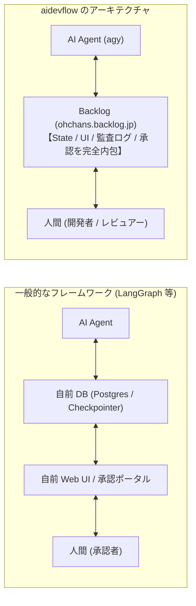
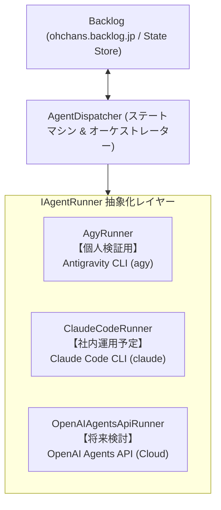

# Agentic SDLC 業界動向 & アーキテクチャ比較調査書
## — Flow Engineering、OpenAI Agents API、および Backlog-driven 設計の優位性 —

## 📚 ドキュメント一覧
- 📝 **[チケット起票テンプレート](TICKET_TEMPLATE.md)** (要件漏れ防止・機能/非機能/DoDチェックリスト)
- 🤖 **[プロジェクト規約テンプレート (AGENTS.md)](AGENTS_TEMPLATE.md)** (被開発リポジトリ用非機能要件・アーキテクチャ標準の正本テンプレート)
- 🏛️ **[システムアーキテクチャ仕様書](architecture.md)** (全体構成・状態遷移・エージェント役割)
- 🌐 **[Agentic SDLC 業界動向 & アーキテクチャ比較](agentic_sdlc_landscape.md)** (本ドキュメント: 業界動向・命名定義・既存FW比較・Backlog=State設計の強み)
- 🚀 **[環境構築 & 運用ガイド](setup_guide.md)** (必要要件・環境変数・systemd常駐化)
- 🔀 **[並行開発 & Git Worktree 仕様書](concurrency_worktree.md)** (Worktree分離・並行数制御・Git排他制御)
- ⚡ **[クォータ消費最適化 & 軽量パイプライン仕様書](quota_optimization.md)** (Fastモード・モデル最適化)
- 🛡️ **[トラブルシューティング & エスカレーション仕様書](troubleshooting.md)** (ループ防止・クォータ停止・プロセスロック)
- 🎼 **[宣言的ワークフローエンジン & 権限制御設計書](declarative_workflow_engine_design.md)** (YAML定義・決定キーワード・edit:false多層防御)

---

## 1. 概要と背景

`aidevflow` は、チーム開発プラットフォーム **Backlog** を起点とし、専門化された複数の AI エージェント（Antigravity CLI: `agy` 等）を自律リレーさせ、要件定義・設計から GitHub プルリクエスト（PR）作成までを自動化するシステムです。

本ドキュメントは、「設計からPR作成までの自動化」を取り巻く **最新の業界標準用語、2026年9月に公開された OpenAI Agents API の技術仕様、既存フレームワーク（OpenHands, MetaGPT, LangGraph, CrewAI等）との比較、および `aidevflow` が採用した『Backlog as a State Store』アーキテクチャの合理性** を体系的に整理・記録した技術調査書です。

---

## 2. 業界標準ターミノロジー（用語の整理）

AIによるソフトウェア開発自動化の領域では、プロンプト単発の指示から、複合的なシステム・パイプライン設計へと急速にパラダイムシフトが進んでいます。

| 用語 | 定義・業界での位置づけ | `aidevflow` での具現化 |
| :--- | :--- | :--- |
| **Agentic SDLC**<br>(自律型ソフトウェア開発ライフサイクル) | **業界全体の統一トレンド用語**（Anthropic, Forrester, Cisco 等が提唱）。単なるコード補完（Copilot）を超え、要件定義・設計・実装・テスト・PR作成・受入確認まで、開発ライフサイクル全般を自律エージェント群がオーケストレーションする開発パラダイム。 | `aidevflow` の目指すシステム領域そのもの。 |
| **Flow Engineering**<br>(フローエンジニアリング) | 単一のプロンプトで一気に解かせるのではなく、仕様策定 ➔ レビュー ➔ 承認 ➔ 実装 ➔ テストといった**一連の決定論的ステップ（反復ループや分岐を含むワークフロー）として設計・制御する手法**（AlphaCodium 論文発祥）。 | 5つの専門エージェントを順次ディスパッチするパイプライン設計手法。 |
| **Agent Harness**<br>(エージェントハーネス) | モデル（LLM頭脳）の外側で、サンドボックス環境、セッション永続化、コンテキスト圧縮、サブエージェント調整、人間の割り込みゲートなどを担う**「エージェント実行・制御基盤」**のこと。 | `aidevflow` の TypeScript デーモン（Git Worktree やプロセス管理、ポーラー）が該当。 |
| **多段SOP**<br>(Standard Operating Procedures) | ソフトウェア企業の業務手順書（SOP）を模し、役割（Spec-Writer, Developer, Reviewer 等）ごとに中間成果物（設計書 markdown 等）をバトンタッチして品質を担保する分業設計。 | 5つの役割リレー（詳細設計 ➔ 設計レビュー ➔ 実装 ➔ 技術レビュー ➔ 要件レビュー）。 |
| **Human-in-the-Loop (HITL)** | すべてを全自動・ブラックボックス化せず、手戻りリスクの大きい節目に「人間の確認・承認ゲート」を差し挟むアーキテクチャ。 | 設計完了時に自動停止する `[設計承認待ち]`（人間承認ゲート）および PR レビュー。 |

> 💡 **「ループエンジニアリング」という言葉について**:  
> 「ループエンジニアリング」という単語は業界の正式用語としては存在しません。LLMが思考と行動を反復する **「Agentic Loop（エージェントループ）」**、段階的パイプラインを組む **「Flow Engineering（フローエンジニアリング）」**、人間の承認を挟む **「Human-in-the-Loop」** などの概念が組み合わさった通称・連想表現と考えられます。

---

## 3. OpenAI 最新動向:「Agents API」（2026年9月10日ローンチ）

OpenAI は 2026年9月10日、AI エージェント構築・実行のためのマネージドクラウド基盤 **「Agents API」パブリックベータ版** を公開しました。

```
POST https://api.openai.com/v1/agents/sessions
Header: OpenAI-Beta: agents=v1
```

### 3.1. 登場の背景と Codex Harness の API 化
これまで自律エージェントを長時間・高精度で動かすには、コンテキスト上限対策（要約・圧縮）、複数エージェントの並列調整、安全なサンドボックス、途中介入を開発者が自前でスクラッチ実装（ハーネス構築）する必要がありました。  
Agents API は、OpenAI 社内で自律コーディングエージェント「Codex」や ChatGPT for Work を支えてきた**実行基盤（Codex Harness）をそのままフルマネージド REST API として外部提供**したものです。

### 3.2. 4 つのコアコンセプト
1. **Agent**: 使用するモデル（例: `gpt-6-astra` など）、指示、ツール、MCP（Model Context Protocol）サーバー、サブエージェント設定（`multi_agent: { enabled: true, max_concurrent_subagents: 3 }`）。
2. **Environment**: エージェントがファイル操作やコマンド実行を行うサンドボックス環境（OpenAI-hosted、Cloudflare/Daytona/E2B/Modal/Vercel 等のパートナー製、自前 VM 内で動かす `codex exec-server` によるセルフホスト）。
3. **Session**: 長時間稼働する永続的なエージェントインスタンス。Webhook やストリーミングで進捗を監視し、人間が途中で介入（Steer/Interrupt）可能。
4. **Events & Items**: 入力指示、途中経過ログ、ツール実行結果、最終成果物。

### 3.3. ハーネスが自動で担う機能
- **自動コンテキスト圧縮 (Automatic Compaction)**: コンテキスト上限に近づくと、過去履歴を自動要約・圧縮。
- **Tool Search**: 大量にあるツール定義を、エージェントが必要とした時だけ動的にコンテキストへ読み込み、トークンとキャッシュを最適化。
- **Programmatic Tool Calling**: サンドボックス内でツールを並列実行・データ集約し、必要な結果のみをコンテキストに還元。
- **Subagents (マルチエージェント)**: 親エージェントが複雑な要件を独立したサブタスクに分割し、子エージェントが独立コンテキストで並列実行。

### 3.4. OpenAI エージェントスタックの棲み分け
| レイヤー | 実行場所 | 状態管理 (State) | 適用シーン |
| :--- | :--- | :--- | :--- |
| **Agents API** | OpenAI のマネージド Codex Harness | OpenAI 側でセッション完全永続化 | インフラ構築不要で、クラウド上に即座に長時間自律エージェントを動かしたい場合 |
| **Agents SDK** (`openai-agents`) | 開発者のアプリ内 | 開発者側のストレージ / SDK セッション | 自前サーバー上で細かいロジック制御やエージェント間ハンドオフを行いたい場合 |
| **Responses API** | 開発者のアプリ内 | 手動の履歴管理 / Response Chaining | 1 ターンごとのツール呼び出しやステートフル対話を柔軟に制御したい場合 |

---

## 4. 既存フレームワーク・プラットフォームとの比較

「要件・Issue から PR 作成までを自動化する」アプローチを持つ代表的なフレームワーク・ツールと `aidevflow` の比較です。

| ツール / フレームワーク | アーキテクチャの思想 | 人間承認 (HITL) の実装方法 | 特徴と実務上の課題 |
| :--- | :--- | :--- | :--- |
| **`aidevflow`** (本システム) | **Backlog 駆動 ＋ 5役多段SOP ＋ Git Worktree ＋ CLI (`agy`)** | **Backlog のステータス変更 (`[設計承認待ち]` ➔ `[処理中]`) とコメント欄** | **日本の開発実務に最適**。UI開発不要、完全ステートレス、複数リポジトリ横断 PR 対応。 |
| **OpenHands** (旧 OpenDevin) | Docker サンドボックス ＋ 単一エージェント完走型 ＋ 専用 Web UI (Agent Canvas) | Web UI 上でのチャット割り込み | GitHub/Linear 前提。多段SOPリレーや Backlog 連携は標準非対応。インフラが重厚。 |
| **MetaGPT** | ソフトウェア企業の SOP（PM ➔ Arch ➔ Dev ➔ QA）をコード化 | 各ステップでのプロンプト承認 (`human-in-the-loop`) | SOP の先駆者だが、CLI デモ色が強く、外部 BTS（Backlog/Jira）連携や長期運用のエコシステムが停滞。 |
| **LangGraph** | ステートマシン（有向グラフ）ベースの汎用オーケストレーション | `interrupt()` と Checkpointer による一時停止・再開 | 自由度は高いが、State 永続化用 DB（PostgresSaver 等）と、人間が承認するための Web UI を自前開発・保守する必要がある。 |
| **CrewAI** | Role, Goal, Backstory を持ったエージェントチームの編成 | `Task(human_input=True)` によるターミナル対話 | Python 製。同期インメモリ実行（`crew.kickoff()`）が前提であり、数時間〜数日間の非同期ステート待機が極めて不向き。 |
| **GitHub Copilot Workspace** | Issue ➔ Spec ➔ Plan ➔ Diff ➔ PR の段階的開発環境 | 各ステップごとの UI 承認ボタン（Next） | 多段SOP ＋ 人間承認の理想的な UX だが、GitHub エコシステム内に完結しており、外部 BTS（Backlog）との連携は不可。 |

---

## 5. `aidevflow` のアーキテクチャ的優位性:「Backlog as a State Store」

世の中のエージェントフレームワーク（LangGraph や OpenHands 等）が「State をどの DB で永続化するか」「人間が承認するための UI をどう構築・運用するか」で大きな開発・インフラコストを払っている中、`aidevflow` が **「Backlog そのものを唯一の正本（Single Source of Truth）の State Store とする」** 設計を選んだことは、圧倒的な実務的メリットを生み出しています。



### 4 大アドバンテージ

1. **管理 UI / ダッシュボードの開発・保守コストが「完全ゼロ」**:
   - カンバンボード、チケット詳細、差分表示、コメント履歴など、人間が必要とするリッチな UI が最初から Backlog 上にすべて揃っています。
   - チーム全員が「いまどの課題が設計中か、承認待ちか」を Backlog を見るだけで一目で把握できます。
2. **デーモンが完全な「ステートレス」になれる（高可用性・耐障害性）**:
   - デーモン自体はメモリやローカル DB に重要なセッション状態を抱え込まないため、サーバー再起動やクラッシュが発生しても、Backlog をポーリング（`bee` CLI）するだけで何事もなかったかのように安全に復帰できます。
3. **完全な監査ログ（Audit Trail）の自動担保**:
   - 「誰が、いつ、どのプロンプト/指示で設計書を書き、誰がそれを承認し、何時何分に PR が出されたか」が Backlog の履歴とコメント欄にタイムスタンプ付きで自動的に刻まれます。コンプライアンス面でも極めてクリーンです。
4. **チームへの認知的負荷がゼロ（既存業務への完全一致）**:
   - 開発者や PM は、新しい AI ツールの使い方や管理画面を覚える必要がありません。
   - 普段通り **「ステータスを『処理中』にする」「修正してほしい点をコメント欄に書く」** という、人間同士のやりとりと全く同じ作法で AI に指示・承認を行えます。

---

## 6. CrewAI 等の外部フレームワークを採用しなかった技術的理由

「CrewAI 等の既存フレームワークを使えばコードをシンプルにできるか？」という検討に対し、以下の理由から **「外部フレームワークを導入せず、現在の Node.js / TypeScript による軽量自作オーケストレーターを維持する」** 方針が最も合理的であると結論づけています。

1. **コードの大部分はインフラ制御（Git・Backlog・Worktree）**:
   - `aidevflow` のコードの大部分は「複数リポジトリの clone / Git Worktree 分離」「Backlog ステータス監視」「クォータ制御」であり、これらは CrewAI を使っても一切削減できません。
2. **実行モデルの不一致（同期的インメモリ vs 長期非同期ステートマシン）**:
   - CrewAI の `crew.kickoff()` はプロセスが生きている間の同期実行を前提としますが、`aidevflow` は「設計完了後に数時間〜翌日の人間承認を待つ」非同期ステートマシンです。CrewAI 上にこれを組むと逆にコードが肥大化します。
3. **エージェント実行モデルの差（LLM API 直接呼び出し vs 自律 CLI `agy`）**:
   - `aidevflow` は Antigravity CLI (`agy`) をサブプロセスとして起動します。`agy` 自体がファイル編集・テスト・Linter の強力な自律ループを持っているため、フレームワーク層で Tool 呼び出しループを再実装する必要がありません。
4. **言語スタック（TypeScript & pnpm vs Python）**:
   - プロジェクト標準である TypeScript & pnpm 環境を維持し、外部ランタイム依存（Python venv 等）を排除して単一の軽量デーモンとして完結させています。

---

## 7. Anthropic のエージェント戦略: OpenAI との思想的対比

OpenAI が「Codex Harness の API 化（マネージド・クラウド・垂直統合型）」を進める一方、**Anthropic は対照的な「オープンプロトコル ＆ 開発者主導型」の戦略** を採っています。

| 比較項目 | OpenAI のアプローチ (Agents API) | Anthropic のアプローチ |
| :--- | :--- | :--- |
| **基本思想** | **垂直統合型（フルマネージド）**<br>「環境もハーネスも OpenAI クラウドでお預かりします」 | **オープンプロトコル ＆ 開発者主導型**<br>「プロトコルと強力なモデルを提供し、制御は手元でやってください」 |
| **実行環境** | クラウド上のホスト型サンドボックス（VM / コンテナ） | **ローカル環境**（開発者のマシン直接）または **OS操作** |
| **代表プロダクト** | **Agents API (Codex Harness)** | **Claude Code** (CLI), **MCP**, **Computer Use** |

### Anthropic の 3 大柱
1. **[MCP (Model Context Protocol)](https://modelcontextprotocol.io/) — 業界標準規格の創出**:
   - 自前で囲い込むのではなく、エージェントと外部ツール・DB・GitHub 等を繋ぐオープン規格を策定・オープンソース化。
   - **OpenAI の Agents API もツール連携に Anthropic の MCP をそのまま採用**しており、オープンな標準規格として定着しています。
2. **Claude Code — ターミナル常駐型の自律コーディング**:
   - クラウドに VM を立てるのではなく、**開発者のローカルターミナルで直接 `git` や `bash`、`grep` を叩いて自律修正する CLI エージェント**。
   - これは Google の Antigravity (`agy`) と同じ設計思想であり、まさに `aidevflow` が採用しているローカル CLI 実行のスタイルです。
3. **「オーケストレーションは自前でシンプルに組め」という思想**:
   - Anthropic は著名なリサーチ記事 *「Building Effective Agents」* の中で、**「ブラックボックスなエージェントフレームワークに頼るな。開発者自身がパイプライン（Prompt Chaining や Evaluator-Optimizer）を制御すべきだ」** と強く提唱しています。

---

## 8. 社内展開ロードマップ: 個人用 `agy` から社内用 `Claude Code` への移行

現在 `aidevflow` は個人開発・検証用として Google の **Antigravity CLI (`agy`)** を呼び出す実装になっていますが、**今後の社内展開においては、社内標準・実績のある Anthropic の `Claude Code` (`claude` CLI) を採用する計画** です。



### なぜこの移行が極めてスムーズに行えるのか？

1. **`IAgentRunner` インターフェースによる完全な抽象化**:
   - `aidevflow` のコアである Backlog 監視（ポーラー）、ステータス遷移（ディスパッチャー）、Git Worktree 管理は、特定のエージェント CLI に依存していません。
   - `src/agents/types.ts` の `IAgentRunner` を実装した `ClaudeCodeRunner` を追加し、`.env` で `AGENT_RUNNER=claude` を指定するだけで切り替えが可能です。
2. **実行モデルの完全な一致（ローカル CLI の非対話実行）**:
   - `agy` も `claude` も、**「ターミナル上で非対話モード（`-p` / `--print` 等）でプロンプトを渡し、自律的にファイル編集・テスト・コミットを実行して終了する」** というアーキテクチャが完全に共通しています。
   - そのため、プロンプトのフォーマット調整とコマンド呼び出しの引数定義を追加するだけで、既存の 5 役リレー（SOP）や Worktree 管理がそのまま動作します。
3. **社内セキュリティ・コンプライアンスへの適合**:
   - クラウドサンドボックスに自社の機密コードを丸ごと送信する方式と異なり、`Claude Code` は**社内サーバーやローカルマシンの Git Worktree 内で閉じて実行される**ため、セキュリティ規程（ソースコードの外部保存禁止等）をクリアしやすい大きな利点があります。

---

## 9. OpenAI Agents API の将来的な取り込み可能性

将来的に、社内インフラの常駐マシンを持たないフルサーバーレス運用や、複数リポジトリの大規模ビルドをクラウドに逃がしたい場合、**OpenAI Agents API を第 3 の Runner としてプラグイン追加** する道も確保されています。

### 取り入れるメリット
*   **ローカルマシンのリソース消費ゼロ**: 重いコンパイルや結合テストを OpenAI のホスト型サンドボックス（または Cloudflare / E2B 等）にオフロード可能。
*   **自動コンテキスト圧縮 (Compaction)**: 長時間のリファクタリングでもトークン上限を意識せず完走できる。

### 導入時の課題とクリアすべき要件
*   **データレジデンシー**: 米国内限定・ZDR 非対応であるため、社内機密コードを扱う場合は、自社環境に `codex exec-server` を立てる**セルフホスト型サンドボックス**を採用する。
*   **Git 認証**: サンドボックス内で GitHub への push を行うための SSH 鍵やトークンを、OpenAI の Vault（`vault_ids`）経由で安全に渡す設計が必要。

---

## 10. まとめ

*   `aidevflow` が行っている「Backlog 監視 ➔ 5役エージェントリレー ➔ 人間の設計承認ゲート ➔ 複数PR作成」は、最新トレンドにおける **「Human-in-the-Loop 型 Agentic SDLC ハーネス」** そのものです。
*   汎用フレームワーク（CrewAI や LangGraph 等）に過度に依存せず、**Backlog を State Store として直接オーケストレーションする自作 TypeScript デーモン** だからこそ、UI 開発コストゼロ・完全ステートレス・高い耐障害性を実現できています。
*   実行ランナーが `IAgentRunner` として抽象化されているため、**「個人検証用の `agy`」から「社内運用の `Claude Code`」、さらには将来の「マネージド `Agents API`」へと、コアの業務ロジックを一切変えずに柔軟に拡張・移行できるアーキテクチャ** が完成しています。

