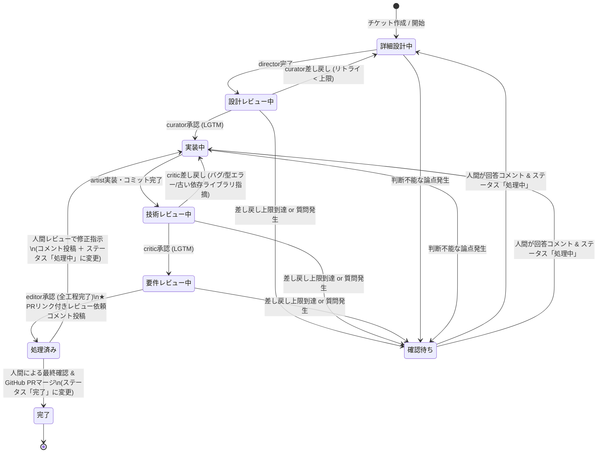
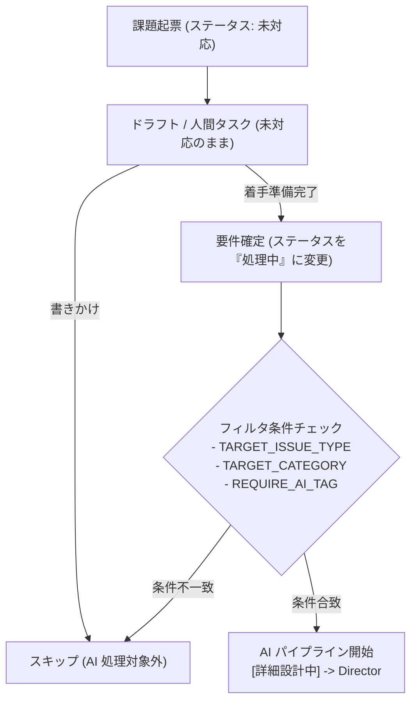

# aidevflow アーキテクチャ仕様書

## 1. 概要

`aidevflow` は、チーム開発プラットフォーム **Backlog** のプロジェクト配下にあるチケット（課題）状態の変化を検知し、人間の開発フローに沿った5つの専門 AI エージェント（**`agy` / Antigravity CLI**）を順次ディスパッチする自律型開発パイプラインの常駐デーモン（TypeScript）です。

### ワークスペース配置仕様（1チケット・複数リポジトリ共存対応）
1つのチケットで複数リポジトリ（例: フロントエンドとバックエンド）にまたがる改修が発生した場合でも衝突せず共存できるよう、**`~/aidevflow/worktrees/<issueKey>/<repoName>/`** の階層構造を採用しています：

```
~/aidevflow/
├── repos/
│   ├── <repoA>/              # 自動 clone / fetch された元リポジトリ A
│   └── <repoB>/              # 自動 clone / fetch された元リポジトリ B
└── worktrees/
    └── <issueKey>/           # チケット専用ルートディレクトリ
        ├── <repoA>/          # リポジトリ A の worktree (ブランチ: issueKey)
        └── <repoB>/          # リポジトリ B の worktree (ブランチ: issueKey)
```

- **作業ブランチ名**: チケットキー `<issueKey>`（例: `STUDY-3`）
- **エージェント実行環境**:
  - 単一リポジトリ時: `~/aidevflow/worktrees/<issueKey>/<repoName>/`
  - 複数リポジトリ時: `~/aidevflow/worktrees/<issueKey>/`（配下に全対象リポジトリの worktree が展開され、リポジトリ間を横断編集可能）
- **GitHub PR 作成**: 変更された各リポジトリごとに PR を自動作成し、Backlog に全 PR リンク一覧を自動コメント。

---

## 2. システム構成図


---

## 3. チケット詳細からの複数リポジトリ指定記法

チケットの「詳細（description）」に、以下のように箇条書きまたはカンマ区切りで複数のリポジトリを記載できます：

```markdown
【対象リポジトリ】
リポジトリ:
- https://github.com/my-org/frontend.git
- https://github.com/my-org/backend.git

【要件】
APIエンドポイントを追加し、UI側でデータを表示する。
```

デーモンは両方のリポジトリを自動でクローンし、
- `~/aidevflow/worktrees/STUDY-3/frontend/`
- `~/aidevflow/worktrees/STUDY-3/backend/`
を準備してエージェントに渡します。
エージェントは両リポジトリのコードを同時に確認・修正可能です。

---

## 4. Backlog レビュー依頼コメント仕様（複数PR対応）

```markdown
### 🚀 【レビュー依頼】AIエージェントによる全工程が完了しました

チケット **STUDY-3: ユーザー管理機能の追加** に対するすべての開発工程（詳細設計 → 設計レビュー → 実装 → 技術レビュー → 要件レビュー）が完了しました。

以下のプルリクエストをご確認の上、レビュー・マージをお願いいたします。

- 🔗 **GitHub プルリクエスト一覧**:
  - **frontend**: https://github.com/my-org/frontend/pull/45
  - **backend**: https://github.com/my-org/backend/pull/82
- **ブランチ**: `STUDY-3`
- **作業 Worktree**: `/home/oharato/aidevflow/worktrees/STUDY-3`
- **ステータス**: 完了

#### 最終要件レビュー報告:
フロントエンド・バックエンド両方の実装が受け入れ要件を満たしていることを確認しました（LGTM）。

---
#### 🚀 手元での動作確認（ローカル検証）手順:
レビュー時に手元でアプリやテストを動かして確認する場合の手順です：

1. **ワークツリーへ移動 & 最新コードの同期**:
   cd /home/oharato/aidevflow/worktrees/STUDY-3/company-search-inquiry
   git pull origin "STUDY-3"

2. **コンテナの一括起動 (Docker Compose)**:
   docker compose up -d --build
   - 停止時: docker compose down
- 💡 ポート番号やAPIエンドポイント等の詳細はリポジトリ内の README.md をご参照ください。

---
#### 👤 人間レビュー後の対応手順:
- **【修正が必要な場合 (AIに再修正させる)】**:
  1. 本チケットのコメント欄に修正指示・指摘を記入してください。
  2. ステータスを「処理中」に変更してください。
- **【問題なく完了・マージする場合】**:
  1. GitHub 上でプルリクエストをマージしてください。
  2. 本チケットのステータスを「完了」に変更してください。
```

---

## 5. 差し戻し無限ループ防止 & 人間エスカレーション仕様

### 状態遷移と人間介入ポイント



### 仕様詳細

1. **差し戻し回数上限制御 (`MAX_REJECTION_COUNT`)**:
   - チケットごとの連続差し戻し回数をデーモンメモリ上で追跡。
   - 上限回数（デフォルト: `3` 回）に達すると、ステータスを **「確認待ち」** (`#f42858` 赤) に変更し、ループ停止理由と現状の論点を整理したコメントを投稿してパイプラインを安全に一時停止します。
   - 各レビューで承認（LGTM）された場合はカウンターが自動リセットされます。

2. **エージェントからの自律解決不能エスカレーション**:
   - 仕様の矛盾や複数のアーキテクチャ選択肢など、AI単独で判断できない要件に直面した場合、エージェントはプロンプトの指示に従って `【人間への確認依頼】` または `CONFIRM_HUMAN` タグ付きで論点を出力します。
   - デーモンはこのタグを検知すると、差し戻し回数に関わらず即座にステータスを **「確認待ち」** に移行します。

3. **人間介入後の再開フロー (Resume)**:
   - 人間が Backlog チケットに回答コメント（指示・仕様の決定）を投稿し、ステータスを「詳細設計中」または「実装中」に戻します。
   - デーモン（`BacklogPoller`）が「確認待ち」からのステータス変更を自動検知し、**差し戻しカウンターをゼロにリセット** します。
   - エージェントは人間の最新コメントを最優先コンテキストとして自律作業を再開します。

4. **人間レビュー後の修正依頼（差し戻し）・完了フロー**:
   - **修正を依頼する場合**:
     - Backlog チケットのコメント欄に修正指示（PRへのコメント参照等）を記入し、ステータスを **「処理中」** に戻します。
     - デーモンが `[要件レビュー完了]` 状態からの「処理中」への変更を検知し、自動的に `artist`（実装）を起動して既存の worktree 上で修正を行い、PR へ追記 push します。
   - **完了とする場合**:
     - GitHub 上で PR をマージし、Backlog チケットのステータスを **「完了」** に変更します。

---

## 6. フリープラン・カスタム状態不可環境での自動フォールバック

Backlog のフリープランや一部下位プランでは、API によるカスタム状態追加が制限されています（`Custom status is not available in this space's plan`）。
これに対応するため、`aidevflow` は起動時に登録ステータスを自動検知し、カスタム状態が存在しない場合は自動的に **「件名プレフィックス ＋ 標準ステータス連携モード」** にフォールバックします。

### 状態・件名のマッピング

| エージェント / フェーズ | 標準ステータス | 件名プレフィックス | 説明 |
| :--- | :--- | :--- | :--- |
| **開始前 / 人間確認待ち** | **未対応** (`statusId=1`) | なし、または `[確認待ち]` | 人間が起票した直後、またはAIからの質問停止時 |
| **Director (詳細設計)** | **処理中** (`statusId=2`) | `[詳細設計中]` | チケット着手直後。要件から詳細設計書を作成 |
| **Curator (設計レビュー)** | **処理中** (`statusId=2`) | `[設計レビュー中]` | 設計書の客観的レビュー・差し戻し判定 |
| **Artist (実装)** | **処理中** (`statusId=2`) | `[実装中]` | コード実装、単体テスト、Git コミット |
| **Critic (技術レビュー)** | **処理中** (`statusId=2`) | `[技術レビュー中]` | 静的解析・型・セキュリティ・品質・言語/依存ライブラリ最新性レビュー |
| **Editor (要件レビュー)** | **処理中** (`statusId=2`) | `[要件レビュー中]` | 元のチケット要件を満たしているかの最終検査 |
| **全工程完了 (PR レビュー待ち)** | **処理済み** (`statusId=3`) | `[要件レビュー完了]` | 人間による PR レビュー・マージ待ち |
| **マージ完了** | **完了** (`statusId=4`) | `[要件レビュー完了]` 等 | 人間が PR をマージしてチケットをクローズ |

### 特徴と利点
1. **設定ゼロの自動判別**: デーモン起動時に `hasCustomStatuses(projectStatuses)` を評価し、モードを自動選択。
2. **Backlog カンバン・一覧での高い視認性**: チケットのタイトル接頭辞に `[詳細設計中]` や `[確認待ち]` が表示されるため、カスタム状態がなくても一目で進捗が把握可能。
3. **安全な再開フロー**: 人間がチケットのステータスを「処理中」に変更するだけで、カウンターがリセットされて自動再開。

---

## 7. ドラフト保護と通常チケットとの共存

同一の Backlog プロジェクト内で、人間が日常的に起票・管理する通常チケット（バグ修正、タスク等）や、作成途中の下書きチケットを誤って AI パイプラインが処理しないよう、多層の保護機構を備えています。



### ① ステータスによるドラフト保護
Backlog でチケットを作成した直後の初期状態は **「未対応」** です。
`aidevflow` は「未対応」状態のチケットを自動実行することはありません。人間が要件や対象リポジトリの記載を完了し、ステータスを **「処理中」**（またはカスタム状態の「詳細設計中」）に変更した段階で初めて自律実行がトリガーされます。

### ② 種別・カテゴリー・タグによる対象の絞り込み
以下の環境変数を設定することで、監視対象チケットを厳密に限定できます：

- `TARGET_ISSUE_TYPE`（例: `AI開発`）: 指定した種別のチケットのみを対象にします。
- `TARGET_CATEGORY`（例: `AIエージェント`）: 指定したカテゴリーが付与されたチケットのみを対象にします。
- `REQUIRE_AI_TAG`（例: `true`）: 件名または本文に `[AI]` や `#ai` タグが含まれるチケットのみを対象にします。

---

## 8. モック起動モード (`AGENT_RUNNER=mock`)

```bash
AGENT_RUNNER=mock pnpm start
```

### 目的
LLM（Claude や Gemini 等）の実際の呼び出しを行わず、各専門エージェント（Director, Curator, Artist, Critic, Editor）の処理結果・承認・成果物生成を数秒の擬似ディレイとともにシミュレートする動作検証モードです。

### 利点と用途
- **トークン消費ゼロ & 即時検証**: API 課金やレートリミットを気にせず、短時間でエンドツーエンドの挙動を確認可能。
- **インフラ・連携疎通の検証**:
  - Backlog API キーの有効性、チケット情報の取得・更新、コメント投稿権限の確認。
  - Git リポジトリの clone、`~/aidevflow/worktrees/` のディレクトリ生成権限。
  - GitHub PR 作成（`DRY_RUN=true` を併用することで GitHub リモートを汚さずシミュレーション可能）。
  - 差し戻し上限到達時の「確認待ち」エスカレーションと人間コメントによる再開フローの確認。

---

## 9. 技術スタック & 設計思想

- **ランタイム**: Node.js LTS (v24.x)
  - 組み込みの `process.loadEnvFile()` を採用。外部 `dotenv` パッケージを排除し、本番依存ゼロ（`dependencies: {}`）を達成。
- **言語**: TypeScript (v7.x)
  - モダンな `strict: true`、Node.js 組み込み型定義（`@types/node`）による堅牢な型安全性を確保。
- **パッケージマネージャー**: `pnpm` (v11.x)
  - サンドボックス環境の ro マウント制約に対応した `.npmrc` 設定。
- **テストフレームワーク**: **Vitest (v4.x)**
  - 高速な実行速度、`vi.fn()` による簡潔なモック定義、ネイティブ TypeScript サポート。
