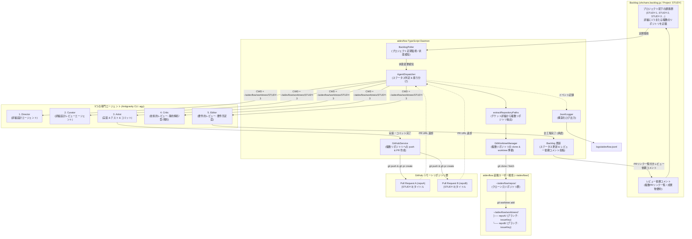
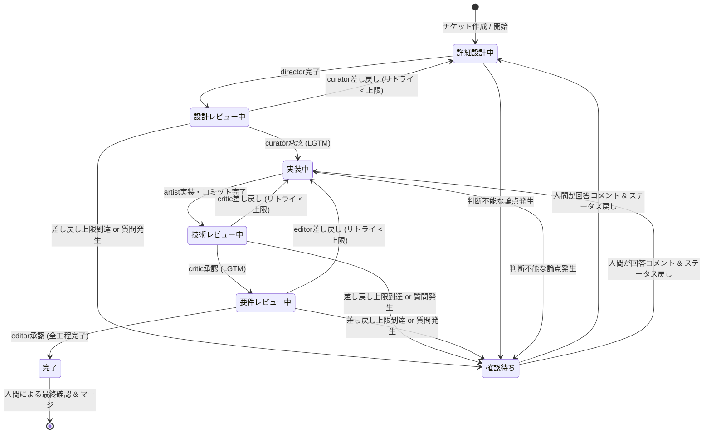

# aidevflow アーキテクチャ仕様書

## 1. 概要

`aidevflow` は、チーム開発プラットフォーム **Backlog** のプロジェクト配下にあるチケット（課題）状態の変化を検知し、人間の開発フローに沿った5つの専門 AI エージェント（**`agy` / Antigravity CLI**）を順次ディスパッチする自律型開発パイプラインの常駐デーモン（TypeScript）です。

### ワークスペース配置仕様（1チケット・複数リポジトリ共存対応）
1つのチケットで複数リポジトリ（例: フロントエンドとバックエンド）にまたがる改修が発生した場合でも衝突せず共存できるよう、**`~/aidevflow/worktrees/<issueKey>/<repoName>/`** の階層構造を採用しています：

```
~/aidevflow/
├── repos/
│   ├── <repoA>/              # 自動 clone / fetch された元リポジトリ A
│   └── <repoB>/              # 自動 clone / fetch された元リポジトリ B
└── worktrees/
    └── <issueKey>/           # チケット専用ルートディレクトリ
        ├── <repoA>/          # リポジトリ A の worktree (ブランチ: issueKey)
        └── <repoB>/          # リポジトリ B の worktree (ブランチ: issueKey)
```

- **作業ブランチ名**: チケットキー `<issueKey>`（例: `STUDY-3`）
- **エージェント実行環境**:
  - 単一リポジトリ時: `~/aidevflow/worktrees/<issueKey>/<repoName>/`
  - 複数リポジトリ時: `~/aidevflow/worktrees/<issueKey>/`（配下に全対象リポジトリの worktree が展開され、リポジトリ間を横断編集可能）
- **GitHub PR 作成**: 変更された各リポジトリごとに PR を自動作成し、Backlog に全 PR リンク一覧を自動コメント。

---

## 2. システム構成図



---

## 3. チケット詳細からの複数リポジトリ指定記法

チケットの「詳細（description）」に、以下のように箇条書きまたはカンマ区切りで複数のリポジトリを記載できます：

```markdown
【対象リポジトリ】
リポジトリ:
- https://github.com/my-org/frontend.git
- https://github.com/my-org/backend.git

【要件】
APIエンドポイントを追加し、UI側でデータを表示する。
```

デーモンは両方のリポジトリを自動でクローンし、
- `~/aidevflow/worktrees/STUDY-3/frontend/`
- `~/aidevflow/worktrees/STUDY-3/backend/`
を準備してエージェントに渡します。
エージェントは両リポジトリのコードを同時に確認・修正可能です。

---

## 4. Backlog レビュー依頼コメント仕様（複数PR対応）

```markdown
### 🚀 【レビュー依頼】AIエージェントによる全工程が完了しました

チケット **STUDY-3: ユーザー管理機能の追加** に対するすべての開発工程（詳細設計 → 設計レビュー → 実装 → 技術レビュー → 要件レビュー）が完了しました。

以下のプルリクエストをご確認の上、レビュー・マージをお願いいたします。

- 🔗 **GitHub プルリクエスト一覧**:
  - **frontend**: https://github.com/my-org/frontend/pull/45
  - **backend**: https://github.com/my-org/backend/pull/82
- **ブランチ**: `STUDY-3`
- **作業 Worktree**: `/home/oharato/aidevflow/worktrees/STUDY-3`
- **ステータス**: 完了

#### 最終要件レビュー報告:
フロントエンド・バックエンド両方の実装が受け入れ要件を満たしていることを確認しました（LGTM）。
```

---

## 5. 差し戻し無限ループ防止 & 人間エスカレーション仕様

### 状態遷移と人間介入ポイント



### 仕様詳細

1. **差し戻し回数上限制御 (`MAX_REJECTION_COUNT`)**:
   - チケットごとの連続差し戻し回数をデーモンメモリ上で追跡。
   - 上限回数（デフォルト: `3` 回）に達すると、ステータスを **「確認待ち」** (`#f42858` 赤) に変更し、ループ停止理由と現状の論点を整理したコメントを投稿してパイプラインを安全に一時停止します。
   - 各レビューで承認（LGTM）された場合はカウンターが自動リセットされます。

2. **エージェントからの自律解決不能エスカレーション**:
   - 仕様の矛盾や複数のアーキテクチャ選択肢など、AI単独で判断できない要件に直面した場合、エージェントはプロンプトの指示に従って `【人間への確認依頼】` または `CONFIRM_HUMAN` タグ付きで論点を出力します。
   - デーモンはこのタグを検知すると、差し戻し回数に関わらず即座にステータスを **「確認待ち」** に移行します。

3. **人間介入後の再開フロー (Resume)**:
   - 人間が Backlog チケットに回答コメント（指示・仕様の決定）を投稿し、ステータスを「詳細設計中」または「実装中」に戻します。
   - デーモン（`BacklogPoller`）が「確認待ち」からのステータス変更を自動検知し、**差し戻しカウンターをゼロにリセット** します。
   - エージェントは人間の最新コメントを最優先コンテキストとして自律作業を再開します。

