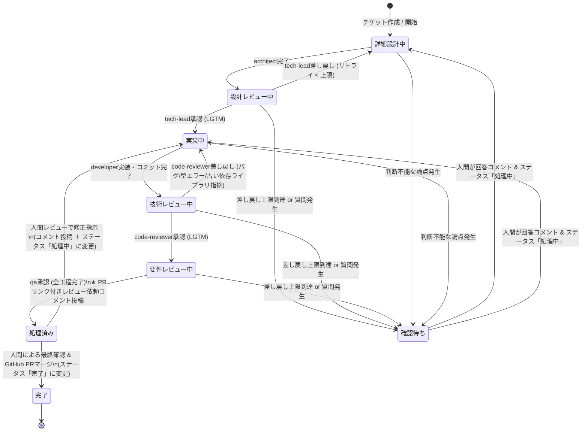
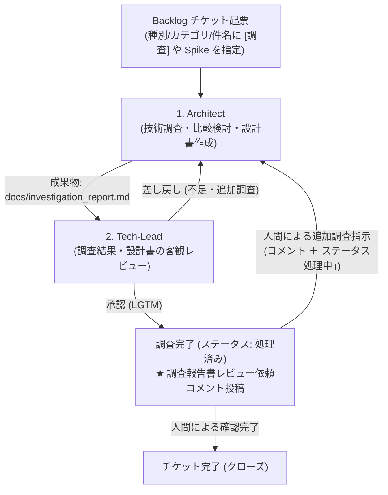
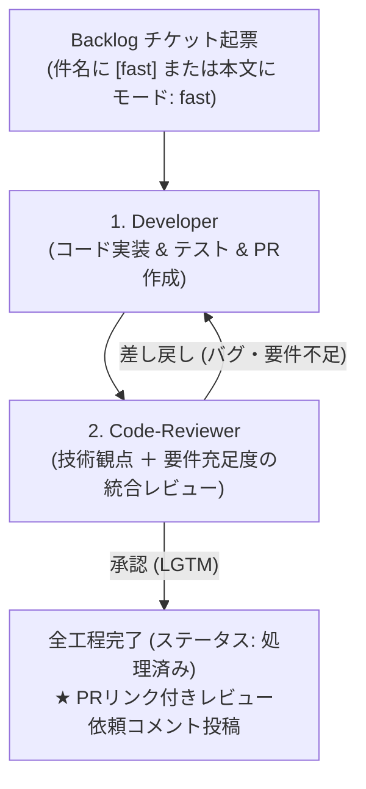
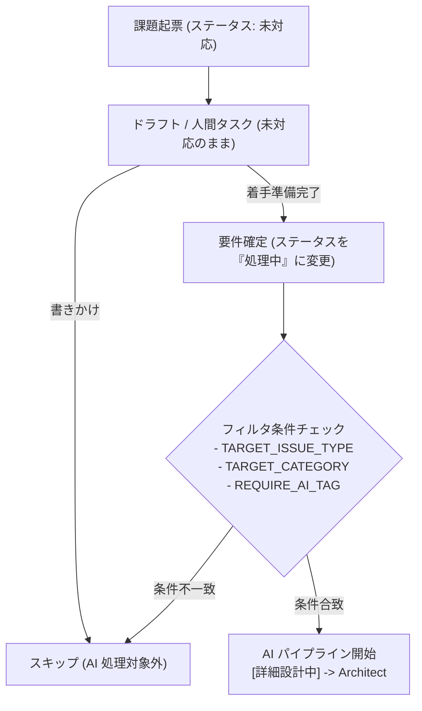

# aidevflow アーキテクチャ仕様書

## 1. 概要

`aidevflow` は、チーム開発プラットフォーム **Backlog** のプロジェクト配下にあるチケット（課題）状態の変化を検知し、人間の開発フローに沿った5つの専門 AI エージェント（**`agy` / Antigravity CLI**）を順次ディスパッチする自律型開発パイプラインの常駐デーモン（TypeScript）です。

### ワークスペース配置仕様（1チケット・複数リポジトリ共存対応）
1つのチケットで複数リポジトリ（例: フロントエンドとバックエンド）にまたがる改修が発生した場合でも衝突せず共存できるよう、**`~/aidevflow/worktrees/<issueKey>/<repoName>/`** の階層構造を採用しています：

```
~/aidevflow/
├── repos/
│   ├── <repoA>/              # 自動 clone / fetch された元リポジトリ A
│   └── <repoB>/              # 自動 clone / fetch された元リポジトリ B
└── worktrees/
    └── <issueKey>/           # チケット専用ルートディレクトリ
        ├── <repoA>/          # リポジトリ A の worktree (ブランチ: issueKey)
        └── <repoB>/          # リポジトリ B の worktree (ブランチ: issueKey)
```

- **作業ブランチ名**: チケットキー `<issueKey>`（例: `STUDY-3`）
- **エージェント実行環境**:
  - 単一リポジトリ時: `~/aidevflow/worktrees/<issueKey>/<repoName>/`
  - 複数リポジトリ時: `~/aidevflow/worktrees/<issueKey>/`（配下に全対象リポジトリの worktree が展開され、リポジトリ間を横断編集可能）
- **GitHub PR 作成**: 変更された各リポジトリごとに PR を自動作成し、Backlog に全 PR リンク一覧を自動コメント。

---

## 2. システム構成図


---

## 3. チケット詳細からの複数リポジトリ指定記法

チケットの「詳細（description）」に、以下のように箇条書きまたはカンマ区切りで複数のリポジトリを記載できます：

```markdown
【対象リポジトリ】
リポジトリ:
- https://github.com/my-org/frontend.git
- https://github.com/my-org/backend.git

【要件】
APIエンドポイントを追加し、UI側でデータを表示する。
```

デーモンは両方のリポジトリを自動でクローンし、
- `~/aidevflow/worktrees/STUDY-3/frontend/`
- `~/aidevflow/worktrees/STUDY-3/backend/`
を準備してエージェントに渡します。
エージェントは両リポジトリのコードを同時に確認・修正可能です。

---

## 4. Backlog レビュー依頼コメント仕様（複数PR対応）

```markdown
### 🚀 【レビュー依頼】AIエージェントによる全工程が完了しました

チケット **STUDY-3: ユーザー管理機能の追加** に対するすべての開発工程（詳細設計 → 設計レビュー → 実装 → 技術レビュー → 要件レビュー）が完了しました。

以下のプルリクエストをご確認の上、レビュー・マージをお願いいたします。

- 🔗 **GitHub プルリクエスト一覧**:
  - **frontend**: https://github.com/my-org/frontend/pull/45
  - **backend**: https://github.com/my-org/backend/pull/82
- **ブランチ**: `STUDY-3`
- **作業 Worktree**: `/home/oharato/aidevflow/worktrees/STUDY-3`
- **ステータス**: 完了

#### 最終要件レビュー報告:
フロントエンド・バックエンド両方の実装が受け入れ要件を満たしていることを確認しました（LGTM）。

---
#### 🚀 手元での動作確認（ローカル検証）手順:
レビュー時に手元でアプリやテストを動かして確認する場合の手順です：

1. **ワークツリーへ移動 & 最新コードの同期**:
   cd /home/oharato/aidevflow/worktrees/STUDY-3/company-search-inquiry
   git pull origin "STUDY-3"

2. **コンテナの一括起動 (Docker Compose)**:
   docker compose up -d --build
   - 停止時: docker compose down
- 💡 ポート番号やAPIエンドポイント等の詳細はリポジトリ内の README.md をご参照ください。

---
#### 👤 人間レビュー後の対応手順:
- **【修正が必要な場合 (AIに再修正させる)】**:
  1. 本チケットのコメント欄に修正指示・指摘を記入してください。
  2. ステータスを「処理中」に変更してください。
- **【問題なく完了・マージする場合】**:
  1. GitHub 上でプルリクエストをマージしてください。
  2. 本チケットのステータスを「完了」に変更してください。
```

---

## 5. 差し戻し無限ループ防止 & 人間エスカレーション仕様

### 状態遷移と人間介入ポイント



### 仕様詳細

1. **差し戻し回数上限制御 (`MAX_REJECTION_COUNT`)**:
   - チケットごとの連続差し戻し回数をデーモンメモリ上で追跡。
   - 上限回数（デフォルト: `3` 回）に達すると、ステータスを **「確認待ち」** (`#f42858` 赤) に変更し、ループ停止理由と現状の論点を整理したコメントを投稿してパイプラインを安全に一時停止します。
   - 各レビューで承認（LGTM）された場合はカウンターが自動リセットされます。

2. **エージェントからの自律解決不能エスカレーション**:
   - 仕様の矛盾や複数のアーキテクチャ選択肢など、AI単独で判断できない要件に直面した場合、エージェントはプロンプトの指示に従って `【人間への確認依頼】` または `CONFIRM_HUMAN` タグ付きで論点を出力します。
   - デーモンはこのタグを検知すると、差し戻し回数に関わらず即座にステータスを **「確認待ち」** に移行します。

3. **エージェント異常終了・LLMクォータ上限（Quota Reached）時の安全停止**:
   - CLI（`agy` / `claude`）のクォータ上限枯渇（`Individual quota reached` / `429 Rate Limit` 等）、タイムアウト、異常終了（終了コード != 0）が発生した場合、**次フェーズへの誤進行や誤った完了判定を厳格に阻止** します。
   - 即座にステータスを **「確認待ち」**（件名プレフィックスモードでは `[確認待ち]` かつ「未対応」）に変更し、エラー詳細と復帰手順を Backlog に自動報告してパイプラインを一時停止します。
   - 再開ロールとしてエラーが発生した同一エージェントが保持されるため、クォータ回復後やエラー解消後にステータスを「処理中」に戻すだけで、失敗したフェーズから安全に自動再開されます。

4. **人間介入後の再開フロー (Resume)**:
   - 人間が Backlog チケットに回答コメント（指示・仕様の決定）を投稿し、ステータスを「詳細設計中」または「実装中」（標準ステータス環境では「処理中」）に戻します。
   - デーモン（`BacklogPoller`）が「確認待ち」からのステータス変更を自動検知し、**差し戻しカウンターをゼロにリセット** します。
   - エージェントは人間の最新コメントを最優先コンテキストとして自律作業を再開します。

5. **人間レビュー後の修正依頼（差し戻し）・完了フロー**:
   - **修正を依頼する場合**:
     - Backlog チケットのコメント欄に修正指示（PRへのコメント参照等）を記入し、ステータスを **「処理中」** に戻します。
     - デーモンが `[要件レビュー完了]` 状態からの「処理中」への変更を検知し、自動的に `developer`（実装）を起動して既存の worktree 上で修正を行い、PR へ追記 push します。
   - **完了とする場合**:
     - GitHub 上で PR をマージし、Backlog チケットのステータスを **「完了」** に変更します。

---

## 6. フリープラン・カスタム状態不可環境での自動フォールバック

Backlog のフリープランや一部下位プランでは、API によるカスタム状態追加が制限されています（`Custom status is not available in this space's plan`）。
これに対応するため、`aidevflow` は起動時に登録ステータスを自動検知し、カスタム状態が存在しない場合は自動的に **「件名プレフィックス ＋ 標準ステータス連携モード」** にフォールバックします。

### 状態・件名のマッピング

| エージェント / フェーズ | 標準ステータス | 件名プレフィックス | 説明 |
| :--- | :--- | :--- | :--- |
| **開始前 / 人間確認待ち** | **未対応** (`statusId=1`) | なし、または `[確認待ち]` | 人間が起票した直後、またはAIからの質問停止時 |
| **Architect (詳細設計)** | **処理中** (`statusId=2`) | `[詳細設計中]` | チケット着手直後。要件から詳細設計書を作成 |
| **Tech-Lead (設計レビュー)** | **処理中** (`statusId=2`) | `[設計レビュー中]` | 設計書の客観的レビュー・差し戻し判定 |
| **Developer (実装)** | **処理中** (`statusId=2`) | `[実装中]` | コード実装、単体テスト、Git コミット |
| **Code-Reviewer (技術レビュー)** | **処理中** (`statusId=2`) | `[技術レビュー中]` | 静的解析・型・セキュリティ・品質・言語/依存ライブラリ最新性レビュー |
| **QA (要件レビュー)** | **処理中** (`statusId=2`) | `[要件レビュー中]` | 元のチケット要件を満たしているかの最終検査 |
| **全工程完了 (PR レビュー待ち)** | **処理済み** (`statusId=3`) | `[要件レビュー完了]` | 人間による PR レビュー・マージ待ち |
| **マージ完了** | **完了** (`statusId=4`) | `[要件レビュー完了]` 等 | 人間が PR をマージしてチケットをクローズ |

### 特徴と利点
1. **設定ゼロの自動判別**: デーモン起動時に `hasCustomStatuses(projectStatuses)` を評価し、モードを自動選択。
2. **Backlog カンバン・一覧での高い視認性**: チケットのタイトル接頭辞に `[詳細設計中]` や `[確認待ち]` が表示されるため、カスタム状態がなくても一目で進捗が把握可能。

---

## 7. 調査タスク対応（実装を伴わない調査・検討・設計パイプライン）

「コード実装ではなく技術調査・比較検討・アーキテクチャ設計・スパイク（Spike）を行いたい」というユースケースに対応するため、**設計（Architect）と設計レビュー（Tech-Lead）のみで完了する調査モード**をサポートしています。



### 1. 調査タスクの自動判別条件
以下のいずれか 1 つを満たすチケットは、自動的に「調査モード」として処理されます：
1. **チケット種別**: `調査`, `リサーチ`, `スパイク`, `Spike`, `Investigation`, `Research`
2. **カテゴリー**: `調査`, `リサーチ`, `Spike`, `Investigation`
3. **件名プレフィックス**: `[調査]`, `【調査】`, `[リサーチ]`, `[spike]`, `[investigation]`, `[調査中]`
4. **本文指定**: `タスク種別: 調査`, `種別: 調査`, `モード: 調査`, `type: investigation`

### 2. 調査タスクにおけるパイプラインの動き
- **Architect（調査・設計）**:
  - チケットの背景や論点に基づき、技術検証、フィジビリティスタディ、比較検討を実施。
  - **リポジトリへのドキュメント作成・修正**:
    - チケット要件や指示（例: 「リポジトリにドキュメント残して」「READMEに追記して」「docs/に設計書を作成して」等）がある場合、リポジトリ内のファイル（`docs/investigation_report.md`、`docs/detailed_design.md`、`README.md`、検証コード等）を直接作成・編集し、Git コミットします。
    - 万が一エージェントがコミットコマンドを実行し忘れた場合でも、デーモンが未コミットの成果物を自動検知して安全に自動コミットします。
- **Tech-Lead（調査レビュー）**:
  - 調査結果やリポジトリの修正差分（git diff）の妥当性、論点の網羅性を客観的にレビュー。
  - 不足があれば Architect へ差し戻し。軽微な修正であれば自らリポジトリファイルを修正してコミット可能。
  - 問題がなければ **「承認（LGTM）」** とし、**Developer（実装）へは進まず全工程完了（調査完了）** と判定。
- **GitHub PR の自動作成**:
  - リポジトリに変更・コミットがある場合、自動的に GitHub へブランチが push され、Pull Request が作成されます。
- **Backlog ステータス更新**:
  - 件名: `[調査完了] チケット名`
  - ステータス: **「処理済み」**（カスタム状態利用時は「完了」）
  - コメント: PR リンク、調査報告書の要約、および人間向けの対応手順（PRマージ方法、追加調査指示方法）を自動投稿。
- **人間による追加指示フロー**:
  - 人間がレビュー後にチケットコメントに追加指示（「〜についてもドキュメントに追記して」等）を書き、ステータスを **「処理中」** に戻すと、自動的に **Architect（再調査・設計修正）** が再起動してリポジトリのドキュメントを更新します。

---

## 8. Fast モード対応（軽量2段階パイプライン: 実装 → 統合レビュー）

「既知の軽微なバグ修正」「文言やスタイルの変更」「小規模なリファクタリング」など、詳細設計フェーズ（Architect/Tech-Lead）を必要としないタスク向けに、**実装（Developer）と統合レビュー（Code-Reviewer）の2フェーズのみで完了する「Fast モード」** をサポートしています。



### 1. Fast モードの自動判別条件
以下のいずれか 1 つを満たすチケットは、自動的に Fast モードとして処理されます：
1. **件名プレフィックス / タグ**: `[fast]`, `【fast】`
2. **本文指定**: `モード: fast`, `モード:fast`, `mode: fast`, `mode:fast`

### 2. Fast モードにおけるパイプラインの動き
- **Developer（実装・PR作成）**:
  - 詳細設計フェーズをスキップし、初期ロールとして直接 `developer` が起動。
  - チケット要件から直接コードを修正し、テストを実行・コミット。
  - 対象リポジトリから GitHub へのブランチ push と Pull Request 作成を自動実行。
  - 完了すると自動的に `[技術レビュー中]` へ遷移。
- **Code-Reviewer（技術＆要件統合レビュー）**:
  - 通常の静的解析・型・セキュリティ・品質レビューに加え、チケットの受け入れ要件を満たしているかを一括レビュー。
  - 問題があれば `developer` へ差し戻し（`[実装中]` へ戻る）。
  - 問題がなければ **承認（LGTM）** し、そのまま **全工程完了（要件レビューフェーズをスキップ）** と判定。
- **完了報告**:
  - ステータスが **「処理済み」**（件名: `[要件レビュー完了]`）に更新され、PRリンク付き完了コメントが自動投稿されます。

---

## 9. クォータ消費最適化アーキテクチャ (Quota Optimization)

LLM（Gemini）の個人クォータ制限（`Individual quota reached` / 429 Rate Limit）を回避し、安定かつ経済的に自律リレーを実行するための多層最適化機構を備えています。

### 1. 軽量高速モデル（Flash）の標準採用 & ロール別指定
- デフォルトランナー（`agy`）の起動時に、モデルを明示的に指定：
  - `AGY_MODEL`: `gemini-3.8-flash-high`（実装・設計・統合レビュー用）
  - `AGY_REVIEW_MODEL`: `gemini-3.8-flash-medium`（レビュー用、オプション）
- Pro モデルと比較して個人クォータ枠が格段に広く、API 制限による停止を回避します。

### 2. 推論エフォート（Effort）の低減
- `AGY_EFFORT=low` を標準化。
- 不要な長期自己検証ループを抑え、思考トークン（Thinking tokens）の消費を大幅に削減します。

### 3. コメント履歴の自動圧縮（Context Optimization）
- Backlog の過去コメント履歴をプロンプトに注入する際、トークン肥大化を防止するインテリジェント圧縮を実施：
  - **人間の指示最優先**: 人間が書き込んだ修正指示や回答コメントは全文をそのまま保持。
  - **AI 報告ログの要約**: AI 自身が過去に出力した長大なマークダウン表やコミット一覧は要約行のみを抽出し、上限 2,500文字程度に圧縮。

---

## 10. ドラフト保護と通常チケットとの共存

同一の Backlog プロジェクト内で、人間が日常的に起票・管理する通常チケット（バグ修正、タスク等）や、作成途中の下書きチケットを誤って AI パイプラインが処理しないよう、多層の保護機構を備えています。



### ① ステータスによるドラフト保護
Backlog でチケットを作成した直後の初期状態は **「未対応」** です。
`aidevflow` は「未対応」状態のチケットを自動実行することはありません。人間が要件や対象リポジトリの記載を完了し、ステータスを **「処理中」**（またはカスタム状態の「詳細設計中」）に変更した段階で初めて自律実行がトリガーされます。

### ② 種別・カテゴリー・タグによる対象の絞り込み
以下の環境変数を設定することで、監視対象チケットを厳密に限定できます：

- `TARGET_ISSUE_TYPE`（例: `AI開発`）: 指定した種別のチケットのみを対象にします。
- `TARGET_CATEGORY`（例: `AIエージェント`）: 指定したカテゴリーが付与されたチケットのみを対象にします。
- `REQUIRE_AI_TAG`（例: `true`）: 件名または本文に `[AI]` や `#ai` タグが含まれるチケットのみを対象にします。

---

## 11. モック起動モード (`AGENT_RUNNER=mock`)

```bash
AGENT_RUNNER=mock pnpm start
```

### 目的
LLM（Claude や Gemini 等）の実際の呼び出しを行わず、各専門エージェント（Architect, Tech-Lead, Developer, Code-Reviewer, QA）の処理結果・承認・成果物生成を数秒の擬似ディレイとともにシミュレートする動作検証モードです。

### 利点と用途
- **トークン消費ゼロ & 即時検証**: API 課金やレートリミットを気にせず、短時間でエンドツーエンドの挙動を確認可能。
- **インフラ・連携疎通の検証**:
  - Backlog API キーの有効性、チケット情報の取得・更新、コメント投稿権限の確認。
  - Git リポジトリの clone、`~/aidevflow/worktrees/` のディレクトリ生成権限。
  - GitHub PR 作成（`DRY_RUN=true` を併用することで GitHub リモートを汚さずシミュレーション可能）。
  - 差し戻し上限到達時の「確認待ち」エスカレーションと人間コメントによる再開フローの確認。

---

## 12. 複数チケット並行開発アーキテクチャ（Git Worktree & Concurrency 制御）

### 概要
`aidevflow` は `git worktree` を最大限に活用し、**複数の Backlog チケットを同時に並行開発**できます。

```
                   Backlog チケット検知
                            │
               ┌────────────┴────────────┐
               ▼                         ▼
          [STUDY-10]                [STUDY-11]
               │                         │
      Git Mutex (親Repo排他)     Git Mutex (親Repo排他)
               │                         │
   worktree: worktrees/STUDY-10    worktree: worktrees/STUDY-11
   branch:   STUDY-10              branch:   STUDY-11
               │                         │
       ┌───────┴───────┐         ┌───────┴───────┐
       ▼               ▼         ▼               ▼
  [developer]   [code-reviewer] [architect]  [tech-lead]
  (Agent #1)                     (Agent #2)
       │                                 │
       └──────────────┬──────────────────┘
                      ▼
     最大同時実行数制御 (MAX_CONCURRENCY = 2)
```

### アーキテクチャ構成要素

1. **ワーカープール / 同時実行数制御 (`MAX_CONCURRENCY`)**:
   - デフォルト `MAX_CONCURRENCY=2`（環境変数または `.env` で設定可能）。
   - エージェントプロセス（CLI）の過密起動によるマシン負荷や LLM クォータ（Rate Limit）の枯渇を防ぎつつ、スロット数に応じて最大 N 件のチケットを非同期並行実行します。
2. **In-Flight チケット管理 (`inFlightIssues: Set<string>`)**:
   - 現在実行中のチケットキーをメモリ上で追跡。
   - バックグラウンドでエージェントが実行されている間、次回以降のポーリングサイクル（例: 10秒毎）でも同一チケットが多重ディスパッチされるのを完全に防ぎます。
   - 処理完了時（成功、差し戻し、エスカレーション、エラー問わず）に `finally` で自動解放されます。
3. **親 Git リポジトリ操作の非同期排他制御 (`KeyedAsyncMutex`)**:
   - `worktree` ディレクトリ自体は `~/aidevflow/worktrees/<issueKey>/<repoName>` と完全に独立していますが、親リポジトリ（`~/aidevflow/repos/<repoName>`）に対する `git clone / fetch / worktree add` は `.git/` 配下のロックファイル（`.git/index.lock` 等）を共有します。
   - 同一親リポジトリに対する準備操作時のみ、アプリケーション内部の非同期 Mutex（[`KeyedAsyncMutex`](file:///home/oharato/workspace/aidevflow/src/git/mutex.ts)）で順番待ち（直列化）を行います。
   - worktree が作成された後は、エージェントは各チケット専用ディレクトリで**完全並行**にコード変更・テスト・コミットを実行できます。
4. **Graceful Shutdown**:
   - デーモン停止シグナル（SIGINT / SIGTERM）受信時、現在実行中のタスク（Promise）が安全に完了するまで待機（`waitForActiveTasks()`）してから終了します。

---

## 13. 技術スタック & 設計思想

- **ランタイム**: Node.js LTS (v24.x)
  - 組み込みの `process.loadEnvFile()` を採用。外部 `dotenv` パッケージを排除し、本番依存ゼロ（`dependencies: {}`）を達成。
- **言語**: TypeScript (v7.x)
  - モダンな `strict: true`、Node.js 組み込み型定義（`@types/node`）による堅牢な型安全性を確保。
- **パッケージマネージャー**: `pnpm` (v11.x)
  - サンドボックス環境の ro マウント制約に対応した `.npmrc` 設定。
- **テストフレームワーク**: **Vitest (v4.x)**
  - 高速な実行速度、`vi.fn()` による簡潔なモック定義、ネイティブ TypeScript サポート。
