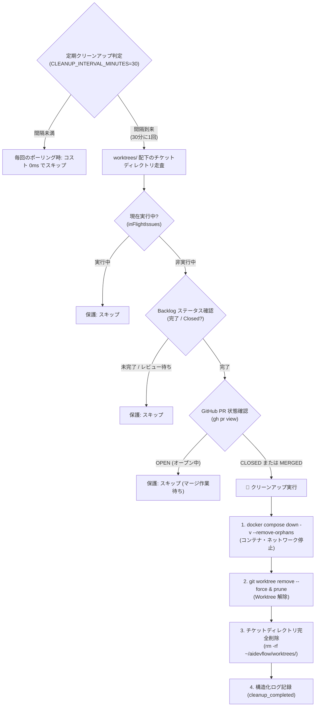

# 複数チケット並行開発 & Git Worktree アーキテクチャ仕様書

本ドキュメントでは、`aidevflow` が実現する `git worktree` を活用した複数チケット・複数リポジトリの並行開発機構、同時実行数制御、および Git 排他制御（Mutex）の設計について詳細に解説します。

---

## 1. ワークスペース配置仕様（完全分離アーキテクチャ）

1つのチケットで複数リポジトリ（例: フロントエンドとバックエンド）を横断修正する場合や、複数のチケットが同一リポジトリを改修する場合でも衝突が起きないよう、**`~/aidevflow/`** 配下に完全分離されたディレクトリ階層を構築します：

```
~/aidevflow/
├── repos/
│   ├── frontend/             # 元リポジトリの clone / fetch 専用キャッシュ
│   └── backend/              # 元リポジトリの clone / fetch 専用キャッシュ
└── worktrees/
    ├── STUDY-10/             # チケット STUDY-10 専用ルートディレクトリ
    │   ├── frontend/         # frontend の worktree (ブランチ: STUDY-10)
    │   └── backend/          # backend の worktree (ブランチ: STUDY-10)
    └── STUDY-11/             # チケット STUDY-11 専用ルートディレクトリ
        └── frontend/         # frontend の worktree (ブランチ: STUDY-11)
```

- **作業ブランチ名**: Backlog 課題キー `<issueKey>`（例: `STUDY-10`）
- **エージェント作業ディレクトリ**:
  - 単一リポジトリ時: `~/aidevflow/worktrees/<issueKey>/<repoName>/`
  - 複数リポジトリ時: `~/aidevflow/worktrees/<issueKey>/`（両リポジトリが直下に展開され、エージェントが横断的にコード・設定を編集可能）

---

## 2. 並行実行モデルとワーカープール制御

```
                   Backlog チケット検知
                            │
               ┌────────────┴────────────┐
               ▼                         ▼
          [STUDY-10]                [STUDY-11]
               │                         │
     KeyedAsyncMutex (親Repo排他) KeyedAsyncMutex (親Repo排他)
               │                         │
   worktree: worktrees/STUDY-10    worktree: worktrees/STUDY-11
   branch:   STUDY-10              branch:   STUDY-11
               │                         │
       ┌───────┴───────┐         ┌───────┴───────┐
       ▼               ▼         ▼               ▼
  [developer]   [code-reviewer] [spec-writer] [spec-reviewer]
  (エージェント #1)               (エージェント #2)
       │                                 │
       └──────────────┬──────────────────┘
                      ▼
     最大同時実行数制御 (MAX_CONCURRENCY = 2)
```

### ① 同時実行数制限 (`MAX_CONCURRENCY`)
- 無制限に並行化を行うと、CLI プロセスが多数起動してホストマシンの CPU/メモリを圧迫し、LLM クォータ（Rate Limit / 429 エラー）が即座に枯渇します。
- `MAX_CONCURRENCY`（デフォルト: `2`）によって、**同時にアクティブになれるチケットタスクの最大数** をスロット管理します。
- 空きスロット（`maxConcurrency - inFlightIssues.size`）がある場合のみ、新規着手可能チケットをバックグラウンド並行起動します。

### ② In-Flight チケット追跡による二重起動防止
- バックグラウンドで非同期タスクが走っている間も、デーモンは定期ポーリング（例: 10秒間隔）を継続します。
- この際、Backlog 上ではタスク完了までステータスが「処理中」のままであるため、そのままでは次回のポーリングでも同一チケットが拾われてしまいます。
- `BacklogPoller` は `inFlightIssues = new Set<string>()` を保持し、**現在エージェント実行中のチケットは次回以降のポーリングで自動的にスキップ** されます。
- 処理完了時（成功、差し戻し、エスカレーション、エラー問わず）に `finally` で自動的に Set から解放されます。

---

## 3. Git 操作の非同期排他制御 (`KeyedAsyncMutex`)

### 課題: Git 内部のファイルロック競合
Git はリポジトリの整合性を保つため、`.git/index.lock` や `.git/refs/heads/<branch>.lock` というファイルレベルの排他ロックを持っています。
もし複数チケットが「同じ親リポジトリ」（`~/aidevflow/repos/<repoName>`）に対して同時に `git fetch` や `git worktree add` を実行すると、Git は順番待ちをせずに以下のエラーで即座にクラッシュします：

```bash
fatal: Unable to create '.git/index.lock': File exists.
Another git process seems to be running in this repository...
```

### 解決策: リポジトリ単位のインメモリ非同期 Mutex
`aidevflow` では、外部ライブラリに依存しない独自の軽量な [`KeyedAsyncMutex`](file:///home/oharato/workspace/aidevflow/src/git/mutex.ts) を実装しています。

```typescript
export class GitWorktreeManager {
  private repoMutex: KeyedAsyncMutex = new KeyedAsyncMutex();

  async ensureWorktree(repoUrlOrPath: string, issueKey: string): Promise<string> {
    const repoName = this.extractRepoName(repoUrlOrPath);

    // リポジトリ単位でロックを取得し、クローン・fetch・worktree add を排他実行
    return this.repoMutex.runExclusive(repoName, async () => {
      // 親リポジトリ操作（数秒で完了）
      ...
      return worktreeDir;
    });
  }
}
```

- **親リポジトリ操作（数秒間）**: アプリケーション側で順番待ちさせて Git の衝突エラーを防止。
- **エージェントの作業（数分〜数十分）**: worktree はチケットごとに別フォルダのため、**完全並行で同時にコード編集・テスト・コミット**が可能。

---

## 4. Graceful Shutdown

デーモンの停止シグナル（`SIGINT` / `SIGTERM` / `pnpm run stop`）を受信した際、実行中のエージェントプロセスを強制中断すると Git の作業ツリー破損や Backlog コメントの不整合が生じます。

`BacklogPoller.stop()` は、現在実行中の全アクティブタスクの完了（`Promise.allSettled`）を待機し、安全にステータス更新とログ出力を終えてからプロセスをクローズします。

---

## 5. 完了チケット & クローズ済み PR のリソース自動クリーンアップ (`ResourceCleaner`)

開発が完了して GitHub PR がマージ・クローズされた後、ローカルに残った作業ツリーや起動中の Docker コンテナを自動的に安全にお掃除する仕組みです。



### ① ポーリングへの負荷を与えない設計
- **ポーリング毎の常時チェックを廃止**: 毎回のポーリング（5〜10秒ごと）ですべての過去チケットや GitHub PR の状態を外部 API で問い合わせると、API 通信量や GitHub の Rate Limit リスクが増大します。
- **定期間隔バックグラウンド実行**: デフォルト 30分（環境変数 `CLEANUP_INTERVAL_MINUTES` で設定可能）に 1 回のみ、バックグラウンド非同期で走ります。
- **ゼロ通信高速スキップ**: worktree ディレクトリが空（0件）の場合は、Backlog や GitHub の API を一切呼び出さずに即座に終了します。

### ② 厳格な安全保護ルール（誤削除防止）
クリーンアップ対象となるのは、**以下の条件をすべて満たした場合のみ** です：
1. 現在デーモン内で実行中（`inFlightIssues`）ではないこと。
2. Backlog のステータスが **「完了」** であること（「未対応」「処理中」「確認待ち」「要件レビュー中」「処理済み」は絶対に削除されません）。
3. 関連リポジトリの GitHub プルリクエストが **「CLOSED」または「MERGED」** であること（PR がまだ `OPEN` の間は、人間がマージ作業中であるため保護されます）。

### ③ クリーンアップされるリソース
1. **Docker Compose の停止・破棄**:
   - worktree 内（およびサブディレクトリ）に存在する `compose.yaml` や `docker-compose.yml` を検知し、`docker compose down -v --remove-orphans` を実行してコンテナやネットワークを停止・解放。
2. **Git Worktree の安全削除**:
   - `git worktree remove --force` で worktree を削除し、親リポジトリで `git worktree prune` を実行。
3. **チケットディレクトリの削除**:
   - `~/aidevflow/worktrees/<issueKey>` を完全削除。

### ④ 手動クリーンアップコマンド (`pnpm run clean`)
定期タイマーを待たずに、手動で今すぐ完了チケットのリソースを掃除したい場合は以下のコマンドを実行できます：

```bash
pnpm run clean
```
