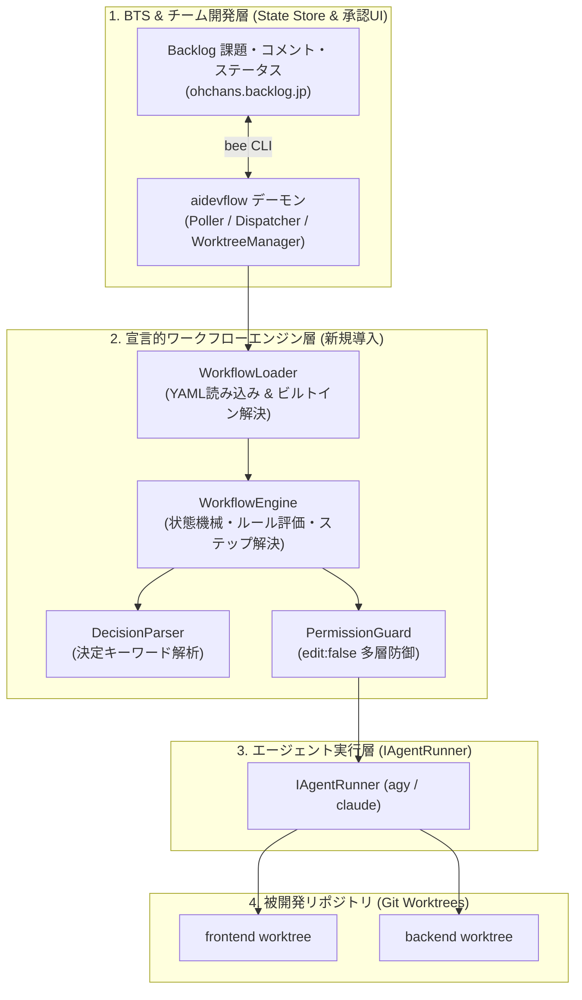
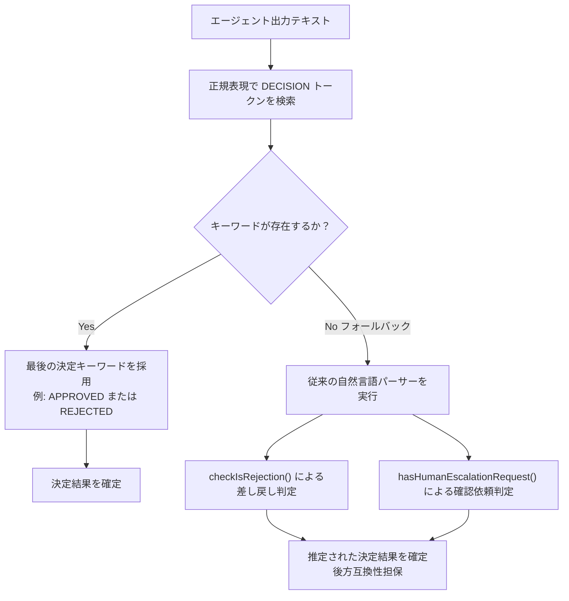
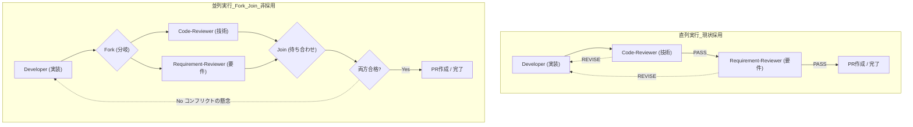

# 宣言的ワークフローエンジン & 権限制御アーキテクチャ設計書
## — TAKT / Just Do It (jdi) の思想を統合した次世代 aidevflow パイプライン —

## 📚 関連ドキュメント
- 🏛️ [システムアーキテクチャ仕様書](architecture.md)
- 🌐 [Agentic SDLC 業界動向 & アーキテクチャ比較](agentic_sdlc_landscape.md)
- 🔀 [並行開発 & Git Worktree 仕様書](concurrency_worktree.md)
- ⚡ [クォータ消費最適化 & 軽量パイプライン仕様書](quota_optimization.md)
- 🛡️ [トラブルシューティング & エスカレーション仕様書](troubleshooting.md)
- 🧩 [Issue Tracker (BTS) 抽象化設計書](issue_tracker_abstraction.md)

---

## 1. 背景と目的

### 1.1. 現状の課題
現在 `aidevflow` は、食べログ技術ブログの思想に基づき「5つの専門エージェントリレー（多段SOP）」を TypeScript のコード内（[`src/daemon/dispatcher.ts`](file:///home/oharato/workspace/aidevflow/src/daemon/dispatcher.ts) 等）で制御しています。
この実装は堅牢で動作実績がある一方、以下の課題を抱えています：

1. **ワークフロー遷移のハードコード**:
   - `spec-writer` ➔ `spec-reviewer` ➔ `developer` ➔ `code-reviewer` ➔ `requirement-reviewer` という一連の順序や戻りループが TypeScript の `switch-case` / `if` 文に固定されており、リポジトリごとのステップ追加（例: セキュリティ特化レビューの追加）やフロー変更が容易ではない。
2. **自然言語パースによる遷移判定の脆弱性**:
   - レビュー結果の「承認（LGTM）」や「差し戻し（REJECT）」、人間への確認依頼（`CONFIRM_HUMAN`）の判定を、LLM の出力テキストに対する正規表現・部分一致で行っているため、エージェントの言い回しの揺らぎによる誤判定リスクがある。
3. **レビュアーの権限制御の欠如**:
   - レビュアー役（`code-reviewer` や `spec-reviewer`）に対し、プロンプト指示頼みで「コードを編集しない」ことを求めているため、LLM が善意で直接コードを修正してしまう「越境修正（レビュアー事故）」を構造的に防ぐ仕組みがない。

### 1.2. 本設計の目的
kenfdev 氏の **「Just Do It (jdi)」** および nrs 氏の **「TAKT」** が採用している以下の 3 大コア技術を `aidevflow` に逆輸入（アプローチ A）します：

1. **YAML 宣言的ワークフロー定義 (`workflows/**/workflow.yaml`)**:
   - ステップの実行順序、ペルソナ/プロンプト、分岐ルール、人間ゲートを YAML で宣言可能にし、リポジトリやタスク種別に応じた柔軟なカスタマイズを実現。
2. **決定キーワード（`<!-- DECISION: ... -->`）による遷移制御**:
   - HTML コメント形式の明確な決定トークンを判定の正本とし、決定論的で堅牢なステップルーティングを実現（従来の自然言語パースはフォールバックとして完全温存）。
3. **権限制御（`edit: false`）による多層防御**:
   - レビュアーや調査役などコード変更を禁止するステップにおいて、プロンプト制約・CLIツール制限・Gitガードレールの 3 層でファイルの不正変更を物理的・論理的に防止。
4. **「Backlog as a State Store」との完全調和**:
   - Backlog のステータス遷移（フリープランの件名プレフィックス運用およびカスタム状態）と、複数リポジトリの Git Worktree 並行制御をそのまま活かしたまま、内部エンジンのみを強化する。

---

## 2. システムアーキテクチャ概要

### 2.1. レイヤー構造と責務分担



### 2.2. 新設モジュールの責務

| モジュール | 配置先パス | 責務 |
| :--- | :--- | :--- |
| **`WorkflowTypes`** | `src/workflow/types.ts` | ワークフロー定義、ステップ、遷移ルール、決定キーワードの型定義 |
| **`WorkflowLoader`** | `src/workflow/loader.ts` | ワークフローYAML、設定、ビルトイン定義の読み込み・検証 |
| **`WorkflowEngine`** | `src/workflow/engine.ts` | 状態機械・次ステップ選定・差し戻し回数管理・完了判定 |
| **`DecisionParser`** | `src/workflow/decision.ts` | 決定キーワード（DECISIONトークン）解析と自然言語フォールバック |
| **`PermissionGuard`** | `src/workflow/permission.ts` | edit:false ステップのツール制限および Git 差分検査・自動リバート |

---

## 3. YAML ワークフロー定義 & ディレクトリ構造仕様

### 3.1. 一元管理ディレクトリ構造 (`workflows/`)

複数リポジトリ（frontend, backend, infra 等）を跨ぐ開発において、各リポジトリに `workflow.yaml` を分散配置すると「どちらの定義に従うべきか」のコンフリクトや管理の二重化が発生します。
そのため、`aidevflow` では被開発リポジトリ側には一切設定ファイルを置かず、**常駐デーモン（`aidevflow`）側の `workflows/` ディレクトリで一元管理** します。

```
aidevflow/
├── workflows/
│   ├── default/                         # 【標準】5役多段SOP
│   │   ├── workflow.yaml
│   │   └── prompts/
│   │       ├── spec-writer.md
│   │       ├── spec-reviewer.md
│   │       ├── developer.md
│   │       ├── code-reviewer.md
│   │       └── requirement-reviewer.md
│   │
│   ├── fast/                            # 【高速】2段階 (dev -> review)
│   │   └── workflow.yaml
│   │
│   ├── research/                        # 【調査・設計】2段階 (spec -> review)
│   │   └── workflow.yaml
│   │
│   └── <PROJECT_KEY>/                   # 【プロジェクト固有カスタマイズ】
│       │                                # default をコピペして作成（例: workflows/STUDY/）
│       ├── workflow.yaml                # ステップ追加・順序変更
│       └── prompts/
│           └── code-reviewer.md         # 上書きしたいプロンプトだけ置けばOK！
```

### 3.2. スキーマ定義 (`WorkflowDefinition`)

ステップ名（キー名）は **完全に可変（ユーザーが自由な識別子を追加可能）** です。
各ステップにチケット連携情報（`step_tag` / `status_name`、および後方互換用の `backlog_tag` / `custom_status`）を紐付けることで、ステップ名が自由であっても BTS 側のステータス同期が破綻なく動作します。

```yaml
# workflows/default/workflow.yaml
name: default
description: "5役多段SOP標準開発パイプライン"
initial_step: spec-writer
max_steps: 20

steps:
  spec-writer:
    role: spec-writer
    title: "詳細仕様策定"
    step_tag: "[詳細設計中]"
    status_name: "詳細設計"
    backlog_tag: "[詳細設計中]" # 後方互換エイリアス
    custom_status: "詳細設計"   # 後方互換エイリアス
    edit: true
    # instruction を省略した場合:
    # 1. workflows/<PROJECT_KEY>/prompts/spec-writer.md
    # 2. workflows/default/prompts/spec-writer.md
    # の順で自動探索・読み込み（default を丸ごとコピーしてそのまま使える）
    rules:
      - if: PLANNED
        goto: spec-reviewer
      - if: HUMAN_REQUIRED
        goto: spec-writer
        human_escalation: true
      - goto: spec-reviewer # フォールバック

  spec-reviewer:
    role: spec-reviewer
    title: "詳細仕様レビュー"
    backlog_tag: "[設計レビュー中]"
    custom_status: "設計レビュー"
    edit: false # 成果物編集を禁止（権限制御）
    rules:
      - if: APPROVED
        goto: developer
        human_gate: true # REQUIRE_HUMAN_SPEC_APPROVAL=true の場合、[設計承認待ち] で停止
      - if: REJECTED
        goto: spec-writer
      - if: HUMAN_REQUIRED
        goto: spec-reviewer
        human_escalation: true
      - goto: developer

  developer:
    role: developer
    title: "コード実装・テスト・PR作成"
    backlog_tag: "[実装中]"
    custom_status: "実装"
    edit: true
    rules:
      - if: IMPLEMENTED
        goto: code-reviewer
      - if: HUMAN_REQUIRED
        goto: developer
        human_escalation: true
      - goto: code-reviewer

  code-reviewer:
    role: code-reviewer
    title: "技術観点レビュー"
    backlog_tag: "[技術レビュー中]"
    custom_status: "技術レビュー"
    edit: false # レビュアーの勝手なコード変更を禁止
    rules:
      - if: APPROVED
        goto: requirement-reviewer
      - if: REJECTED
        goto: developer
      - if: HUMAN_REQUIRED
        goto: code-reviewer
        human_escalation: true
      - goto: requirement-reviewer

  requirement-reviewer:
    role: requirement-reviewer
    title: "要件充足度レビュー"
    backlog_tag: "[要件レビュー中]"
    custom_status: "要件レビュー"
    edit: false # レビュアーの勝手なコード変更を禁止
    rules:
      - if: APPROVED
        goto: COMPLETE
      - if: REJECTED
        goto: developer
      - if: HUMAN_REQUIRED
        goto: requirement-reviewer
        human_escalation: true
      - goto: COMPLETE
```

### 3.3. プロンプト（Instruction）の解決順序

各ステップ実行時、エージェントに渡すプロンプトは以下の順序で自動解決されます：

1. **明示指定**: YAML 内に `instruction: "..."` が指定されていれば、そのファイルを最優先で読み込む。
2. **プロジェクト固有プロンプト**: `workflows/<PROJECT_KEY>/prompts/<step_name>.md` が存在すれば読み込む。
3. **デフォルトプロンプト**: `workflows/default/prompts/<step_name>.md`（または `<role>.md`）が存在すれば読み込む。default ディレクトリをコピーしてそのまま利用可能。
4. **汎用ミニマルテンプレート**: 上記のいずれにも該当しないカスタムステップの場合、タスク概要・AGENTS.md 規約・決定キーワード出力指示のみを含んだ汎用プロンプトを動的生成。

### 3.4. ワークフロー定義の解決優先順位 (Resolution Order)

チケット処理時、デーモンは以下の順序でワークフロー定義を自動判定・選択します：

1. **Fast モード**: 件名に `[fast]`、または本文に `mode: fast` ➔ `workflows/fast/workflow.yaml`
2. **Research モード**: 件名に `[research]`（または従来の `[調査]`）、または種別が「調査」 ➔ `workflows/research/workflow.yaml`
3. **プロジェクト固有定義**: チケットの Backlog プロジェクトキー（例: `STUDY`）に対応する `workflows/<PROJECT_KEY>/workflow.yaml` があれば採用。
4. **標準デフォルト**: 上記に該当しない場合は `workflows/default/workflow.yaml` を採用。

> 💡 **完全なゼロコンフィグ後方互換**:
> カスタムディレクトリを作成しなくても、`workflows/default/`, `workflows/fast/`, `workflows/research/` が最初から同梱されているため、既存の運用は 100% そのまま動作します。

---

## 4. 決定キーワード（Decision Keywords）仕様

### 4.1. キーワード一覧とセマンティクス

エージェント出力には、HTML コメント形式の決定トークン `<!-- DECISION: キーワード -->` を付与します。HTML コメントとすることで、マークダウン本文やプログラムコード、Git diff の内容と干渉せず、LLM の思考ログや本文末尾に安全に埋め込むことができます。

| 決定キーワード | 出力トークン例 | 意味 | 主な発行元ロール |
| :--- | :--- | :--- | :--- |
| `PLANNED` | `DECISION: PLANNED` | 仕様策定・調査が完了し、次フェーズへ進める状態 | `spec-writer` |
| `IMPLEMENTED` | `DECISION: IMPLEMENTED` | コード実装・テスト・コミットが完了した状態 | `developer` |
| `APPROVED` | `DECISION: APPROVED` | レビューを承認（LGTM）し、次フェーズまたは完了へ進める状態 | レビュアー各役 |
| `REJECTED` | `DECISION: REJECTED` | 問題・指摘があり、前ステップへ修正差し戻す状態 | レビュアー各役 |
| `HUMAN_REQUIRED` | `DECISION: HUMAN_REQUIRED` | 人間の判断・確認が必要なため、パイプラインを一時停止する状態 | 全ロール |

※ 実際のエージェント出力時は `<!-- DECISION: APPROVED -->` のように HTML コメント形式で出力されます。

### 4.2. パースアルゴリズム (`DecisionParser`)



1. **最新トークンの優先**: 出力テキスト内に複数のキーワードが含まれている場合（例: 思考ログ内での引用と最終結論）、**末尾に最も近い最後のキーワード** を採用します。
2. **二重防御（フォールバック）**:
   - LLM が万が一キーワードを出力し忘れた場合、従来の [`checkIsRejection()`](file:///home/oharato/workspace/aidevflow/src/agents/runner.ts#L106) および [`hasHumanEscalationRequest()`](file:///home/oharato/workspace/aidevflow/src/daemon/dispatcher.ts#L40) をフォールバックとして呼び出します。これにより、パース不能によるパイプライン停止を防止します。

---

## 5. 権限制御（Permission Enforcement: `edit: false`）仕様

TAKT の最も重要な知見である「レビュアーによる勝手なコード書き換えの防止」を、以下の **3 層防御（Triple Guardrails）** で実現します。

```
┌─────────────────────────────────────────────────────────┐
│ 第 1 層: プロンプト制約 (Instruction Constraints)        │
│ 「ファイルの編集・作成・変更ツールの実行は厳禁です」         │
├─────────────────────────────────────────────────────────┤
│ 第 2 層: CLI ツール権限制限 (Tool Execution Restrictions) │
│ Claude Code: --disallowed-tools "Edit,Write"            │
│ Antigravity: Read-only ツールセットの注入               │
├─────────────────────────────────────────────────────────┤
│ 第 3 層: Git 差分ガードレール (Git State Guardrail)       │
│ 実行前後の git status / git diff 検査                    │
│ 不正なファイル変更・コミットがあれば即時 git reset --hard  │
└─────────────────────────────────────────────────────────┘
```

### 5.1. 第 1 層: プロンプト制約
`edit: false` のステップを実行する際、共通ヘッダーに以下の制約プロンプトを注入します：
```markdown
【重要: 権限制限 (Read-Only)】
あなたはこのステップにおいて【完全な読み取り専用（レビュアー）】です。
リポジトリ内のいかなるファイルも作成・編集・削除・コミットしてはなりません。
指摘・フィードバックは出力文（コメント）のみに記述してください。
```

### 5.2. 第 2 層: CLI ツール権限制限
- **Claude Code CLI (`claude`)**:
  - `edit: false` の場合、コマンドライン引数に `--disallowed-tools "Edit,Write,NotebookEditCell"` を付与して起動（`ClaudeCliRunner.buildArgs()` で実装済み）。
  - 実行ディレクトリは必ずチケットの worktree（`context.workDir`）。`AGENT_WORKDIR`（デーモン自身のチェックアウト）は worktree が渡されない場合のフォールバックのみ。
- **Antigravity CLI (`agy`)**:
  - 利用可能なツール群から書き込み系ツールを除外、またはプロンプト指示による厳格制御。

### 5.3. 第 3 層: Git 差分ガードレール (`PermissionGuard`)
万が一エージェントが権限をすり抜けてファイルを変更・コミットした場合の物理的セーフティネットです：
1. **実行前ハッシュ記録**: ステップ開始直前に `git rev-parse HEAD` および `git status --porcelain` の状態を記録。
2. **実行後検査**: ステップ終了直後、作業ツリーに未コミットの変更があるか、あるいは新しいコミットが積まれていないかをチェック。
3. **自動ロールバック**:
   - `edit: false` にもかかわらず変更が検知された場合：
     - 未コミット変更: `git reset --hard HEAD && git clean -fd` で破棄。
     - 不正コミット: `git reset --hard <実行前コミットHASH>` で元に戻す。
     - ログに `[PermissionGuard] ⚠️ レビュアーエージェントによる不正なファイル変更を検知し、安全にロールバックしました。` と記録し、Backlog コメントにも注意書きを付与。

---

## 6. 実装コンポーネント詳細設計

### 6.1. ディレクトリ構成
```
src/
├── workflow/                       # 新設: 宣言的ワークフローエンジン
│   ├── types.ts                    # ワークフロー・ステップ・ルールの型定義
│   ├── decision.ts                 # 決定キーワードパーサー
│   ├── permission.ts               # 権限制御ガードレール
│   ├── loader.ts                   # YAMLローダー & ビルトイン定義
│   └── engine.ts                   # 状態遷移実行エンジン
├── daemon/
│   ├── dispatcher.ts               # WorkflowEngine を利用するようにリファクタ
│   ├── poller.ts
│   └── ...
├── agents/
│   ├── prompts.ts                  # 決定キーワード案内をプロンプトに追加
│   └── runner.ts                   # PermissionGuard との連携
└── ...
```

### 6.2. 主要インターフェース定義

```typescript
// src/workflow/types.ts

export type DecisionKeyword =
  | "PLANNED"
  | "IMPLEMENTED"
  | "APPROVED"
  | "REJECTED"
  | "HUMAN_REQUIRED";

export interface WorkflowRule {
  if?: DecisionKeyword;
  goto: string;                    // 次のステップ名、または "COMPLETE", "ABORT"
  human_gate?: boolean;            // 人間承認待ち（未対応）で停止するか
  human_escalation?: boolean;      // 確認待ち（未対応）で停止するか
}

export interface WorkflowStep {
  name: string;
  role: AgentRole;
  title: string;
  backlog_tag: string;             // 例: "[詳細設計中]"
  custom_status: string;           // 例: "詳細設計"
  edit: boolean;                   // true: 編集可, false: 読み取り専用
  model?: string;
  effort?: "low" | "medium" | "high";
  rules: WorkflowRule[];
}

export interface WorkflowDefinition {
  name: string;
  description?: string;
  initial_step: string;
  max_steps?: number;
  steps: Record<string, WorkflowStep>;
}

export interface StepEvaluationResult {
  nextStepName: string | "COMPLETE" | "ABORT";
  decision: DecisionKeyword;
  isRejection: boolean;
  isEscalation: boolean;
  isHumanGate: boolean;
  targetBacklogTag: string;
  targetCustomStatus: string;
}
```

---

## 7. 段階的実装ロードマップ (Phased Rollout)

本改修は既存の安定したデーモン稼働を損なわないよう、以下の 4 フェーズで段階的に進めます：

### 7.1. フェーズ別実装計画

#### 🔹 Phase 1: 決定キーワードの導入
- **実装内容**:
  - `src/workflow/decision.ts` の作成
  - プロンプト末尾に決定キーワード出力指示を追加
  - `runner.ts` / `dispatcher.ts` でパーサーを呼び出し
- **期待効果・検証**:
  - 差し戻し/承認/確認依頼の誤判定を即座に激減
  - 既存の単体テスト（Vitest）がすべてパスすることを確認

#### 🔹 Phase 2: 権限制御ガードレール
- **実装内容**:
  - `src/workflow/permission.ts` の作成
  - `edit: false` 時のプロンプト制約注入と Git ロールバック機能
  - レビュアー実行時のファイル変更を防止
- **期待効果・検証**:
  - レビュアーがコードを勝手に編集・コミットする事故を構造的にゼロ化

#### 🔹 Phase 3: ワークフローエンジン構築
- **実装内容**:
  - `src/workflow/types.ts`, `loader.ts`, `engine.ts` の作成
  - プリセット定義（default, fast, research）の YAML/オブジェクト化
- **期待効果・検証**:
  - ワークフロー遷移のロジックをエンジンとして単体テスト可能にする

#### 🔹 Phase 4: Dispatcher 統合（実装済み）
- **実装内容**:
  - `dispatcher.ts` は、エージェント実行後に決定キーワード（差し戻し / 人間確認要請の判定を最優先、次に `<!-- DECISION -->`、無ければロール既定値）を解決し、現在ステップの `rules` を `WorkflowEngine.evaluateNextStep()` で評価して次ステップ・`human_gate`・`human_escalation`・`COMPLETE` を決定する
  - 現在ステップが `workflow.yaml` に存在しない場合（レガシーなカスタム状態名のみ等）に限り、従来のハードコード遷移にフォールバックする
  - 次ステップを解決できない場合は「コメントのみ投稿して処理中のまま放置」せず、「確認待ち」に倒して停止する
- **期待効果・検証**:
  - `workflows/<PROJECT_KEY>/workflow.yaml` の `rules` / `goto` / `human_gate` が実行時に効くため、プロジェクト固有のステップ追加・遷移変更がコード修正なしで可能
  - 組み込み 5 役以外の `role` を持つカスタムステップにも汎用プロンプトが生成される

---

## 8. テスト・検証戦略

1. **DecisionParser の単体テスト (`test/workflow/decision.test.ts`)**:
   - `<!-- DECISION: APPROVED -->` の抽出、複数キーワード時の末尾抽出、大文字小文字の許容。
   - キーワードが存在しない場合の従来の自然言語フォールバック（否定文パターンの除外など）。
2. **PermissionGuard の単体テスト (`test/workflow/permission.test.ts`)**:
   - 一時 Git リポジトリを作成し、`edit: false` 時に未コミット差分やコミットが追加された場合の自動ロールバック検証。
3. **WorkflowEngine の状態遷移テスト (`test/workflow/engine.test.ts`)**:
   - default ワークフローにおける 5 役リレーのステップ遷移（正常系、差し戻し系、人間承認ゲート、確認依頼）。
   - fast モード、research モードの短縮遷移の検証。
4. **AgentDispatcher との統合テスト (`test/daemon/dispatcher-workflow.test.ts`)**:
   - モックランナー（`AGENT_RUNNER=mock`）を用いた Backlog チケット処理の一気通貫シミュレーション。

---

## 9. 設計検討記録 (ADR): ステップ並列化（Fork-Join）の非採用判断

### 9.1. 検討の背景と課題認識
ワークフローの総所要時間（Wall-clock time）を短縮するため、「実装完了後、コードレビュー（`code-reviewer`）と要件レビュー（`requirement-reviewer`）を並列（Fork）で走らせ、両方が合格したら完了（Join）とする並列化アーキテクチャ」について検討を行いました。



### 9.2. メリット・期待効果
- **所要時間の短縮**: レビューが各2分の場合、直列4分から並列約2〜2.5分へ短縮可能（約40%短縮）。
- **観点の独立性**: 技術視点（型・テスト・構文）と要件視点（DoD・仕様適合性）をバイアスなく同時に集約可能。

### 9.3. デメリットおよび非採用の決定理由 (Trade-offs)

本プロジェクトでは以下の 4 つの重大なトレードオフと複雑化リスクを考慮し、**「1チケット内でのステップ並列化（垂直並列化）は行わない」** というアーキテクチャ判断を行いました。

#### ① 待ち合わせ（Join）とフィードバック衝突 (Feedback Conflict)
直列実行であれば、技術レビューでコードを整えた上で要件レビューを行うため、Developer への指示が段階的かつ整理されます。
しかし並列実行では、両方が `REVISE`（差し戻し）となった場合、**「技術的なリファクタ指示」と「要件変更・フラグ追加指示」が同時に返り、プロンプト内で指示がコンフリクトしたり、片方の修正が漏れるハルシネーション** を誘発しやすくなります。

#### ② エラー・クォータ制限時の状態管理の極端な複雑化
- **片肺飛行・キャッシュ無効化**:
  一方のエージェントが LLM クォータ制限（429）やタイムアウトで停止した場合、もう片方の成功結果を何時間キャッシュするのか、その間にブランチに変更が入った場合のキャッシュ破棄（Cache Invalidation）など、極めて重厚な状態管理が必要になります。
- **遅延エージェント問題 (Straggler Problem)**:
  Code-Reviewer が 1 分で終わっても、Requirement-Reviewer が外部ドキュメント検索等で 8 分かかった場合、待ち合わせによって全体の短縮効果が相殺されます。

#### ③ 無駄な LLM トークン / クォータの浪費 (フェイルファストの喪失)
- **直列**: 実装に重大なバグや構文エラーがある場合、`code-reviewer` が即座に不合格を出し、`requirement-reviewer` は **起動すらされずトークン消費ゼロ** で済みます。
- **並列**: 実装が壊れていても両方が同時に走り、**片方が致命的エラーでもう片方のレビューが無駄になり、LLM クォータを二重浪費** します。

#### ④ `Backlog = State` 原則との矛盾
aidevflow は「Backlog の課題ステータスを唯一の真実（Single Source of Truth）」とするステートマシンです。
Backlog のステータスは単一選択であるため、並列実行中に「技術レビュー中」なのか「要件レビュー中」なのかを表現できず、ステータス同期の透明性が損なわれます。

### 9.4. 結論と代替アプローチ
1. **チケット間の並行処理（水平並列化）に集中（推奨）**:
   1 チケット内のステップはシンプルな「直列ステートマシン」を維持し、`MAX_CONCURRENCY` と `Git Worktree` 分離による **「複数チケットの並行処理」** で開発スループットを最大化します。
2. **レビュー時間短縮が必要な場合の代替案**:
   ステップを物理的に並列化するのではなく、**「1 回のレビューエージェント実行で、技術面と要件面を同時に審査する統合プロンプト（シングルステップ・マルチ観点）」** を採用することで、状態の複雑化ゼロ・トークン消費最小限で短縮を実現します。

