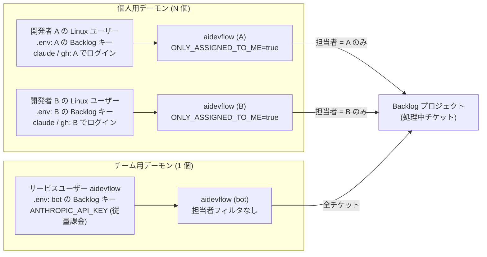
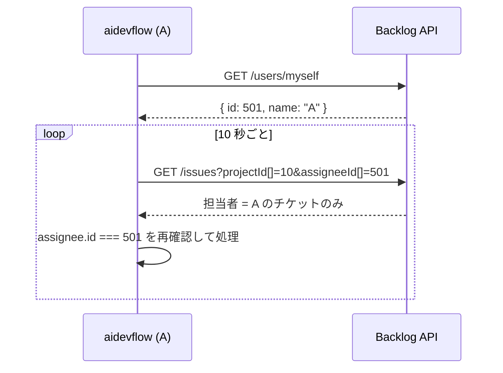

# デーモン配置設計書: 個人用デーモン vs チーム用デーモン

- 作成日: 2026-09-15
- 対象: 共用の開発用 VM 上で aidevflow を常駐させる際の配置方式の選定
- 関連: [環境構築 & 運用ガイド](setup_guide.md) / [システムアーキテクチャ仕様書](architecture.md) / [並行開発 & Git Worktree 仕様書](concurrency_worktree.md)

---

## 結論

1. **まず「個人用デーモン」で開始する**。各開発者が VM に自分の Linux ユーザーでログインし、自分の Backlog API キー・Claude Code ログイン・`gh` 認証で自分のデーモンを動かす。
2. **個人用を成立させるために担当者フィルタ（`config.yml` の `tracker.filter.only_assigned_to_me: true`、環境変数 `ONLY_ASSIGNED_TO_ME`）を追加した**。同一プロジェクトを複数デーモンが監視しても、担当者が自分のチケットしか処理しない。
3. **チーム用デーモン（サービスユーザー + bot キー）は第 2 段階**とする。ライセンス・API キー発行・監査要件が固まり、ワークフロー調整の知見が溜まってから移行する。
4. **移行は設定変更で済む**。`config.yml` の担当者フィルタを外し（または bot を担当者にする運用にし）、`.env` のキーを bot 用に差し替えるだけで、コードの改修は不要。

---

## 2 方式の構造



図: 同じ Backlog プロジェクトに対して、個人用は担当者で分担し、チーム用は 1 つの bot が全件を処理する。

---

## 比較: 7 つの視点

表のセルは事実のみ。理由は表の下に書く。

| 視点 | 個人用デーモン | チーム用デーモン |
| :--- | :--- | :--- |
| LLM 認証 | 個人の Claude Code シート (ログイン) | 従量課金 API キー |
| 追加コスト | なし (シートに含まれる) | API 利用料 + 上限監視 |
| Backlog / GitHub の名義 | 本人 | bot |
| 秘密情報の置き場所 | 各ユーザーのホーム (N セット) | サービスユーザーのホーム (1 セット) |
| 権限の範囲 | 本人の権限と一致 | bot の権限 (全員の和以上になりがち) |
| 障害の影響範囲 | 本人のみ | 全員 |
| 同時実行数の制御 | デーモンごとに `MAX_CONCURRENCY` (合計 2×N) | 1 箇所で VM 全体を制御 |

### 個人用が有利な点

- **開始コストがゼロに近い**。既存の Claude Code シートと `gh` ログインで動くため、API キー発行や稟議を待たない。
- **監査が自動で成立する**。PR・コメント・LLM 利用のすべてが本人名義で残り、本人の権限を超えた操作が構造的に起きない。
- **障害が閉じる**。クォータ枯渇ロック (`.aidevflow.quota.lock`) やクラッシュは本人のデーモンにしか影響しない。

### チーム用が有利な点

- **運用の一元化**。バージョンアップ・`.env` 変更・ワークフロー改善が 1 回で全員に反映される。
- **コストの可視化**。Anthropic Console でチケット単位の利用料が見え、月次上限も 1 箇所で設定できる。
- **VM リソースの統制**。`MAX_CONCURRENCY` と worktree キャッシュ (`~/aidevflow/repos`) が 1 つで済む。

### それぞれの主な欠点

- 個人用: デーモンが N 個になり「動かない」問い合わせが個別化する。Docker Compose のホストポートがユーザー間で衝突する。対話用 Claude Code とクォータを食い合う。
- チーム用: 単一障害点になる。「誰が AI を動かしたか」を Backlog の更新履歴から追う必要がある。Claude Code のログイン認証を複数人で共有する形はライセンス上の想定外なので、API キー一択になる。

---

## 個人用デーモンの実現方式: 担当者フィルタ

### 動作

1. デーモン起動後、初回ポーリングで Backlog の `GET /users/myself` を 1 回呼び、API キー所有者のユーザー ID を取得してキャッシュする。
2. 課題一覧取得 `GET /issues` に `assigneeId[]=<自分の ID>` を付けて、Backlog 側で絞り込む。
3. 取得後も `assignee.id` を再確認し、担当者なしのチケットは除外する（API 側の絞り込みが効かなかった場合の保険）。



図: 担当者フィルタ有効時のポーリング。自分のユーザー情報は起動中 1 回だけ取得する。

### 変更箇所

| ファイル | 変更内容 |
| :--- | :--- |
| `src/backlog/client.ts` | `getMyself()` 追加、`getIssues` に `assigneeId[]` 対応 |
| `src/tracker/types.ts` | `IssueFilterOptions.onlyAssignedToMe`、`TrackedIssue.assigneeId / assigneeName` 追加 |
| `src/tracker/adapters/backlog-tracker.ts` | `resolveMyself()` と候補チケットの担当者フィルタ |
| `src/tracker/adapters/mock-tracker.ts` | `setCurrentUser()` と同フィルタ（テスト用） |
| `src/config.ts` / `src/index.ts` / `src/daemon/poller.ts` | 設定 `tracker.filter.only_assigned_to_me`（環境変数 `ONLY_ASSIGNED_TO_ME`）の読み込み・受け渡し・起動ログ |

### 運用ルール（個人用）

1. チケットを「処理中」にする前に **担当者を自分に設定する**。担当者なしのチケットはどのデーモンも拾わない。
2. 他人に引き継ぐときは **担当者を変更してから**「処理中」に戻す。引き継ぎ先のデーモンが以降のステップを続ける（worktree は引き継ぎ先のホームに新規作成される）。
3. `MAX_CONCURRENCY` は VM の CPU/メモリを人数で割って決める。目安は 1 人あたり 1〜2。
4. `docker compose` を使うリポジトリでは、ホスト側ポートを固定せず `127.0.0.1::3000` のように動的割り当てにする。

---

## セットアップ手順（個人用・1 人分）

```bash
# 1. 自分のユーザーで VM にログインし、クローンする
git clone git@github.com:<org>/aidevflow.git ~/workspace/aidevflow
cd ~/workspace/aidevflow && pnpm install && pnpm build

# 2. 認証（すべて自分のアカウント）
claude          # 初回ログイン後 /exit
gh auth login

# 3. 設定（秘密情報は .env、個人固有値は config.local.yml、チーム共通は config.yml）
printf 'BACKLOG_API_KEY=<自分の個人 API キー>\n' > .env && chmod 600 .env
cp config.local.yml.example config.local.yml
```

`config.local.yml` に以下を設定する。担当者フィルタ（`tracker.filter.only_assigned_to_me: true`）とランナー（`agent.runner: claude`）はチーム共通の `config.yml` に入っているので触らない。

```yaml
tracker:
  backlog:
    space_id: <スペースID>
    project_key: <プロジェクトキー>
daemon:
  max_concurrency: 1   # 共用 VM では 1 人あたり 1〜2
```

```bash
# 4. 起動確認 → systemd ユーザーユニットで常駐化
pnpm start        # ログに「フィルタ: 担当者が自分（API キー所有者）のチケットのみ対象」が出れば OK
```

常駐化のユニット定義は [環境構築 & 運用ガイド](setup_guide.md#4-本格的な常駐化手順-systemd-ユーザーサービス) を参照。VM で `loginctl enable-linger <user>` を有効にしないと、ログアウト時にユーザーユニットが止まる。

---

## チーム用デーモンへの移行手順

1. サービスユーザー `aidevflow` を作成し、Backlog に bot ユーザーを追加して API キーを発行する。
2. Anthropic Console で API キーを発行し、月次上限を設定する。
3. サービスユーザーのホームに aidevflow をクローンし、`config.local.yml` で `tracker.filter.only_assigned_to_me: false` を上書き、`.env` に bot の `BACKLOG_API_KEY` と `ANTHROPIC_API_KEY` を置く。
4. 各個人のデーモンを停止し、個人で調整した `workflows/<PROJECT_KEY>/` を統合する。

移行時に追加すると欠点が消える改修（未実装）:

- PR 本文と Backlog コメントに「チケットを処理中にした人」を自動記載する。
- 1 人あたりの同時実行スロット上限（公平性制御）。
- クォータロック発生時の Slack 通知。

---

## ハマりどころ

- **担当者なしのチケットは誰も処理しない**。個人用モードで「処理中にしたのに動かない」場合は、まず担当者欄を確認する。
- **`GET /users/myself` は API キーの所有者を返す**。bot キーを個人用モードで使うと、bot が担当者のチケットしか拾わない。
- **systemd から起動したシェルの PATH は最小構成**。`claude` / `gh` / `node` は mise や `~/.local/bin` にあるため、ユニットの `Environment=PATH=...` か起動スクリプトで PATH を足す必要がある。
- **`.aidevflow.lock` と `.aidevflow.quota.lock` はクローンディレクトリ基準**。同じユーザーが 2 つのクローンから起動すると多重起動防止が効かない。1 ユーザー 1 クローンにする。
- **Claude Code のログイン認証を複数人で共有する運用は公式に明記がない**。チーム用ではログイン共有ではなく API キーを使う。

## 参考

- Backlog API: [課題一覧の取得](https://developer.nulab.com/ja/docs/backlog/api/2/get-issue-list/)（`assigneeId[]` パラメータ）
- Backlog API: [認証ユーザー情報の取得](https://developer.nulab.com/ja/docs/backlog/api/2/get-own-user/)
- [Anthropic Console: 利用上限の設定](https://console.anthropic.com/settings/limits)
