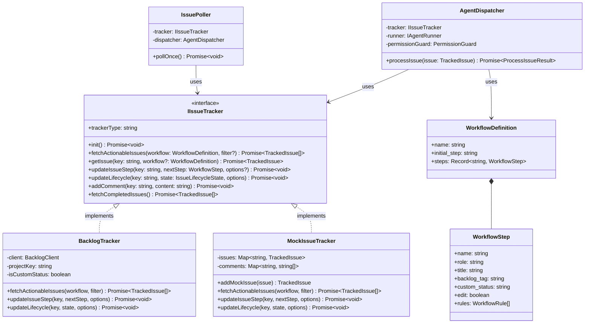

# Issue Tracker (BTS) 抽象化 設計書 (動的ワークフロー対応版)

本ドキュメントは、`aidevflow` における課題管理システム（BTS: Bug Tracking System / Issue Tracker）の密結合を解消し、**宣言的ワークフロー定義（`workflow.yaml`）によってユーザーが自由に定義したエージェントステップ（ロール）**と連動可能なプラットフォーム非依存の抽象レイヤー（`IIssueTracker`）を導入するための詳細設計書です。

当面は **Step 1（Backlog アダプター化・動的ステップマッピング）** および **Step 2（MockIssueTracker によるテスト拡充）** を対象とし、GitHub Issues 等への拡張（Step 3）は将来展望として整理します。

---

## 📚 ドキュメント一覧
- 🏛️ **[システムアーキテクチャ仕様書](architecture.md)** (全体構成・状態遷移・エージェント役割)
- 🎼 **[宣言的ワークフローエンジン & 権限制御設計書](declarative_workflow_engine_design.md)** (YAML定義・決定キーワード・多層防御)
- 🔀 **[並行開発 & Git Worktree 仕様書](concurrency_worktree.md)** (Worktree分離・並行数制御)
- ⚡ **[クォータ消費最適化 & 軽量パイプライン仕様書](quota_optimization.md)** (Fastモード・モデル最適化)
- 🛡️ **[トラブルシューティング & エスカレーション仕様書](troubleshooting.md)** (ループ防止・クォータ停止)
- 🧩 **[Issue Tracker (BTS) 抽象化設計書](issue_tracker_abstraction.md)** (本ドキュメント: 動的ステップ対応BTS抽象化・BacklogAdapter・MockTracker)

---

## 1. 背景と設計方針の刷新

### 1.1 動的ワークフロー導入に伴う前提の変化
直前のアップデートにより、`aidevflow` は固定の 5 役（`spec-writer`, `spec-reviewer`, `developer`, `code-reviewer`, `requirement-reviewer`）に縛られず、**ユーザーが `workflows/<PROJECT_KEY>/workflow.yaml` で任意のステップ名、ロール名、権限（`edit: true/false`）、遷移ルールを自由に定義できる「宣言的ワークフローエンジン」** を獲得しました。

例として、ユーザーは以下のような独自の自律開発ステップを定義可能です：
- `architect`（アーキテクチャ設計・ADR作成）
- `planner`（タスク分解・見積もり）
- `developer`（実装・単体テスト）
- `security-auditor`（脆弱性検査・静的解析）
- `doc-writer`（ドキュメント生成・README更新）

### 1.2 従来の BTS 抽象化案の課題
従来の「固定のフェーズ enum（`spec-writing`, `implementing` 等）」による抽象化では、ユーザーが `workflow.yaml` に定義したカスタムステップを表現できず、ワークフローの柔軟性を殺してしまいます。

### 1.3 本設計の基本方針
1. **固定フェーズ enum の完全排除**:
   - パイプライン内の各工程は、固定の型定義ではなく **`workflow.yaml` で定義された動的なステップ名（`stepName: string`）** として扱います。
2. **共通ライフサイクル状態（`IssueLifecycleState`）の分離**:
   - 「いまどのステップを実行しているか（動的なステップ名）」と、「チケット自体がどのようなライフサイクルにあるか（未着手・進行中・承認待ち・確認待ち・完了）」を直交する概念として分離します。
3. **`WorkflowStep` と BTS 表現の動的マッピング**:
   - `workflow.yaml` 内の各ステップ定義（`WorkflowStep`）には、既に `backlog_tag`（例: `"[詳細設計中]"`, `"[セキュリティ監査中]"`) や `custom_status`（例: `"詳細設計"`, `"セキュリティ監査"`) が定義されています。
   - BTS トラッカー（`BacklogTracker`）は、ハードコードされたステータス判定ではなく、**ロードされた `WorkflowDefinition` を参照してチケットの件名やステータスを動的に照合・更新** します。
   - これにより、ユーザーが YAML に新しいステップを追加するだけで、コードを一切変更することなく Backlog 上のステータスや件名プレフィックスと自動連動します。

---

## 2. 全体アーキテクチャ & レイヤー設計

### 2.1 コンポーネント関係図



### 2.2 レイヤーと責務

| レイヤー | クラス / モジュール | 主な責務 |
| :--- | :--- | :--- |
| **Workflow Engine** | `src/workflow/` (`engine.ts`, `loader.ts`, `decision.ts`, `permission.ts`) | ・ユーザー定義 `workflow.yaml` のロードと正規化<br>・決定キーワード（`<!-- DECISION: ... -->`）による次ステップ評価<br>・権限制御（`edit: false` 時の Git スナップショット & 自動ロールバック） |
| **Tracker Abstraction** | `src/tracker/` (`types.ts`, `index.ts`) | ・BTS 非依存の課題データ構造（`TrackedIssue`）<br>・BTS 非依存のライフサイクル状態（`IssueLifecycleState`）<br>・`WorkflowDefinition` と連動するチケット操作インターフェース（`IIssueTracker`） |
| **Tracker Adapters** | `BacklogTracker`<br>`MockIssueTracker`<br>*(将来: GitHubIssueTracker)* | ・`WorkflowStep` のメタデータ（`backlog_tag`, `custom_status` 等）に基づく BTS 固有データとの動的マッピング<br>・BTS 固有の制約（MySQL絵文字サニタイズ、コメント整形等）のカプセル化 |
| **Pipeline Daemon** | `AgentDispatcher`<br>`IssuePoller`<br>`ResourceCleaner` | ・並行制御・ポーリング・Worktree 準備・PR 作成<br>・エージェント実行基盤（`IAgentRunner`）へのディスパッチ |

---

## 3. コアインターフェース & データモデル定義 (`src/tracker/types.ts`)

### 3.1 共通ライフサイクル状態 (`IssueLifecycleState`)

ステップ名（エージェント役割）とは直交する、チケット共通のライフサイクル状態です。

```typescript
/**
 * チケットの共通ライフサイクル状態
 */
export type IssueLifecycleState =
  | "ready"                 // 未着手 (Backlog: 未対応 / GitHub: open)
  | "in_progress"           // ワークフローステップ実行中 (Backlog: 処理中)
  | "waiting_approval"      // 人間の承認ゲート待ち (human_gate: true による一時停止)
  | "waiting_confirmation"  // 人間の確認待ち (エスカレーション / 質問 / クォータ枯渇)
  | "completed";            // ワークフロー全工程完了 (処理済み・完了 / PR作成済み)
```

### 3.2 抽象チケットデータ型 (`TrackedIssue`)

```typescript
import type { WorkflowStep } from "../workflow/types.js";

export interface TrackedIssue {
  /** チケット識別子 (例: "STUDY-3", "issue-42") */
  key: string;

  /** BTS 内部の数値ID (存在する場合) */
  id?: string | number;

  /** クリーンなタイトル (タグ等を除去した要約) */
  title: string;

  /** BTS 上の生のタイトル (例: "[詳細設計中] ユーザー認証の追加") */
  rawTitle: string;

  /** チケット本文 (要件定義、対象リポジトリ指定等) */
  description: string;

  /** チケットから検知された現在のワークフローステップ名 (例: "spec-writer", "architect") */
  currentStepName?: string;

  /** 検知されたステップ定義 (workflow.yaml に合致した場合) */
  currentStepDef?: WorkflowStep;

  /** チケットのライフサイクル状態 */
  lifecycleState: IssueLifecycleState;

  /** BTS 側のステータス名 (表示・ログ用) */
  rawStatusName: string;

  /** Web URL */
  url?: string;

  /** 直近のコメント履歴 (整形済みテキスト配列) */
  recentComments: string[];

  /** 種別名 (例: "タスク", "調査") */
  issueType?: string;

  /** カテゴリー / ラベル一覧 */
  categories?: string[];

  /** 調査タスクフラグ */
  isInvestigation: boolean;

  /** Fast モードフラグ */
  isFastMode: boolean;

  /** 更新日時 (キャッシュ比較用) */
  updatedAt: string;
}
```

### 3.3 トラッカー操作パラメータ

```typescript
export interface IssueFilterOptions {
  targetIssueType?: string;
  targetCategory?: string;
  requireAiTag?: boolean;
}

export interface StepTransitionOptions {
  comment?: string;
  newSummary?: string;
}

export interface LifecycleTransitionOptions {
  reason?: string;
  comment?: string;
  newSummary?: string;
}
```

### 3.4 トラッカーインターフェース (`IIssueTracker`)

```typescript
import type { WorkflowDefinition, WorkflowStep } from "../workflow/types.js";

export interface IIssueTracker {
  /** トラッカー識別子 ("backlog" | "mock" 等) */
  readonly trackerType: string;

  /** 初期化 (プロジェクト取得、ステータスモード検知等) */
  init(): Promise<void>;

  /**
   * ワークフロー定義に基づき、着手可能（担当ステップが特定され、かつ進行可能な状態）なチケットを取得
   */
  fetchActionableIssues(
    workflowDef: WorkflowDefinition,
    filter?: IssueFilterOptions
  ): Promise<TrackedIssue[]>;

  /**
   * 特定チケットの最新状態を取得
   */
  getIssue(key: string, workflowDef?: WorkflowDefinition): Promise<TrackedIssue>;

  /**
   * 次のワークフローステップへ遷移 (BTS のステータスやタグを更新)
   */
  updateIssueStep(
    key: string,
    nextStep: WorkflowStep,
    options?: StepTransitionOptions
  ): Promise<void>;

  /**
   * ライフサイクル状態を変更 (確認待ち、承認待ち、完了等への移行)
   */
  updateLifecycle(
    key: string,
    state: IssueLifecycleState,
    options?: LifecycleTransitionOptions
  ): Promise<void>;

  /**
   * コメントのみを投稿
   */
  addComment(key: string, content: string): Promise<void>;

  /**
   * クリーンアップ対象の完了チケット一覧を取得
   */
  fetchCompletedIssues(): Promise<TrackedIssue[]>;

  /**
   * 直近のコメント本文一覧を取得 (最新順または時系列)
   */
  getRecentComments?(key: string, limit?: number): Promise<string[]>;

  /**
   * カスタムステータス運用モードか否か (false: 件名プレフィックスモード)
   */
  isCustomStatusMode?(): boolean;

  /**
   * プロジェクトステータス定義の動的注入 (テスト・同期用)
   */
  setProjectStatuses?(statuses: Array<{ id?: number | string; name: string } | unknown>): void;
}
```

---

## 4. Step 1: BacklogTracker 実装設計 (動的ステップ対応)

### 4.1 クラス構成 (`src/tracker/adapters/backlog-tracker.ts`)

`BacklogTracker` は低レベルの [`BacklogClient`](file:///home/oharato/workspace/aidevflow/src/backlog/client.ts) をカプセル化し、**`WorkflowDefinition` の各ステップ設定（`backlog_tag`, `custom_status`）を用いて動的に課題を検知・更新**します。

```typescript
export class BacklogTracker implements IIssueTracker {
  readonly trackerType = "backlog";

  private client: BacklogClient;
  private projectKey: string;
  private projectId: number | null = null;
  private projectStatuses: BacklogStatus[] = [];
  private isCustomMode: boolean = false;
  private customStatusModeOverride?: boolean;

  constructor(options: {
    client: BacklogClient;
    projectKey: string;
    customStatusModeOverride?: boolean;
  }) {
    this.client = options.client;
    this.projectKey = options.projectKey;
    this.customStatusModeOverride = options.customStatusModeOverride;
  }

  // ...
}
```

### 4.2 ワークフロー定義に基づく動的ステップ検知 (`resolveStepFromIssue`)

ハードコードされた正規表現を排除し、**ロードされた `WorkflowDefinition` のステップ一覧と照合** します。

```typescript
private resolveStepFromIssue(
  issue: BacklogIssue,
  workflowDef: WorkflowDefinition
): { step?: WorkflowStep; state: IssueLifecycleState } {
  const statusName = issue.status.name;

  // 1. 人間確認待ち（確認待ちステータス、または [確認待ち] タグ）
  if (statusName.includes("確認待ち") || issue.summary.includes("[確認待ち]")) {
    return { state: "waiting_confirmation" };
  }

  // 2. 人間設計承認待ち ([設計承認待ち] タグ)
  if (issue.summary.includes("[設計承認待ち]")) {
    // 未対応の間は承認待ち、人間が「処理中」に変更した場合は初期実装ステップへ
    if (statusName.includes("未対応")) {
      return { state: "waiting_approval" };
    }
  }

  // 3. 全工程完了 ([完了] / [要件レビュー完了] / [調査完了] または完了ステータス)
  if (
    statusName.includes("完了") ||
    issue.summary.includes("[完了]") ||
    issue.summary.includes("[要件レビュー完了]") ||
    issue.summary.includes("[調査完了]")
  ) {
    return { state: "completed" };
  }

  // 4. カスタム状態モードにおけるステップ照合
  if (this.isCustomMode) {
    for (const step of Object.values(workflowDef.steps)) {
      if (
        step.custom_status &&
        statusName.toLowerCase().includes(step.custom_status.toLowerCase())
      ) {
        return { step, state: "in_progress" };
      }
    }
  }

  // 5. 件名プレフィックスモードにおけるステップ照合
  for (const step of Object.values(workflowDef.steps)) {
    if (step.backlog_tag && issue.summary.includes(step.backlog_tag)) {
      return { step, state: "in_progress" };
    }
  }

  // 6. タグなしで「処理中」になっている場合の初期ステップ解決
  if (statusName.includes("処理中")) {
    const initialStep = workflowDef.steps[workflowDef.initial_step];
    return { step: initialStep, state: "in_progress" };
  }

  // 着手前 (未対応)
  return { state: "ready" };
}
```

### 4.3 ステップ遷移・ステータス更新の動的化 (`updateIssueStep`)

`WorkflowEngine` の評価結果（次に進むべき `WorkflowStep`）を受け取り、そのステップ定義に記載されたタグ・ステータスに従って Backlog を更新します。

```typescript
async updateIssueStep(
  key: string,
  nextStep: WorkflowStep,
  options: StepTransitionOptions = {}
): Promise<void> {
  const comment = options.comment ? sanitizeBacklogText(options.comment) : undefined;

  if (this.isCustomMode) {
    // 1. カスタム状態モード: nextStep.custom_status に対応する statusId を探索
    const targetStatusId = this.findStatusIdByName(nextStep.custom_status);
    if (targetStatusId) {
      await this.client.updateIssue(key, { statusId: targetStatusId, comment });
      return;
    }
  }

  // 2. 件名プレフィックスモード: nextStep.backlog_tag で件名を更新
  const issue = await this.client.getIssue(key);
  const cleanTitle = stripPhasePrefix(issue.summary);
  const newSummary = `${nextStep.backlog_tag} ${cleanTitle}`;
  const inProgressStatusId = this.findStatusIdByName("処理中") || 2;

  await this.client.updateIssue(key, {
    summary: sanitizeBacklogText(newSummary),
    statusId: inProgressStatusId,
    comment,
  });
}
```

### 4.4 ライフサイクル更新 (`updateLifecycle`)

エスカレーション（確認待ち）や人間承認待ち、完了時のステータス変更も、Backlog の動作モードに応じて安全に実行します。

- **`waiting_confirmation` (確認待ち)**:
  - カスタム状態モード: ステータスを「確認待ち」に変更。
  - プレフィックスモード: 件名に `[確認待ち]` を付与し、ステータスを「未対応」（人間に気付かせるため）に変更。
- **`waiting_approval` (設計承認待ち)**:
  - 件名に `[設計承認待ち]` を付与し、ステータスを「未対応」に変更。
- **`completed` (完了 / レビュー待ち)**:
  - カスタム状態モード: ステータスを「完了」に変更。
  - プレフィックスモード: 件名に `[要件レビュー完了]` 等を付与し、ステータスを「処理済み」に変更。

---

## 5. Step 2: MockIssueTracker & 動的ワークフローのテスト設計

### 5.1 クラス構成 (`src/tracker/adapters/mock-tracker.ts`)

テスト実行時に外部通信を行わず、任意のワークフロー定義（カスタムステップを含む）の動作を検証できるインメモリトラッカーです。

```typescript
export class MockIssueTracker implements IIssueTracker {
  readonly trackerType = "mock";

  private issues: Map<string, TrackedIssue> = new Map();
  private commentHistory: Map<string, string[]> = new Map();
  public stepTransitions: Array<{ key: string; nextStep: WorkflowStep }> = [];
  public lifecycleTransitions: Array<{ key: string; state: IssueLifecycleState }> = [];

  addMockIssue(issue: Partial<TrackedIssue> & { key: string; title: string }): TrackedIssue {
    const fullIssue: TrackedIssue = {
      key: issue.key,
      title: issue.title,
      rawTitle: issue.rawTitle || issue.title,
      description: issue.description || "",
      lifecycleState: issue.lifecycleState || "ready",
      rawStatusName: issue.rawStatusName || "未対応",
      recentComments: issue.recentComments || [],
      isInvestigation: issue.isInvestigation ?? false,
      isFastMode: issue.isFastMode ?? false,
      updatedAt: new Date().toISOString(),
      ...issue,
    };
    this.issues.set(issue.key, fullIssue);
    return fullIssue;
  }

  async init(): Promise<void> {}

  async fetchActionableIssues(
    workflowDef: WorkflowDefinition,
    filter?: IssueFilterOptions
  ): Promise<TrackedIssue[]> {
    return Array.from(this.issues.values()).filter((issue) => {
      if (filter?.targetIssueType && issue.issueType !== filter.targetIssueType) return false;
      if (filter?.requireAiTag && !issue.title.includes("[AI]")) return false;

      // 進行中かつステップが割り当てられているものを抽出
      if (issue.lifecycleState !== "in_progress") return false;
      if (!issue.currentStepName) return false;

      // ワークフロー定義に存在するステップであること
      return Boolean(workflowDef.steps[issue.currentStepName]);
    });
  }

  async getIssue(key: string): Promise<TrackedIssue> {
    const issue = this.issues.get(key);
    if (!issue) throw new Error(`Mock issue not found: ${key}`);
    return { ...issue };
  }

  async updateIssueStep(
    key: string,
    nextStep: WorkflowStep,
    options: StepTransitionOptions = {}
  ): Promise<void> {
    const issue = this.issues.get(key);
    if (!issue) throw new Error(`Mock issue not found: ${key}`);

    this.stepTransitions.push({ key, nextStep });
    issue.currentStepName = nextStep.name;
    issue.currentStepDef = nextStep;
    issue.lifecycleState = "in_progress";
    issue.rawTitle = `${nextStep.backlog_tag} ${issue.title}`;
    if (options.comment) {
      this.recordComment(key, options.comment);
    }
  }

  async updateLifecycle(
    key: string,
    state: IssueLifecycleState,
    options: LifecycleTransitionOptions
  ): Promise<void> {
    const issue = this.issues.get(key);
    if (!issue) throw new Error(`Mock issue not found: ${key}`);

    this.lifecycleTransitions.push({ key, state });
    issue.lifecycleState = state;
    if (options.comment) {
      this.recordComment(key, options.comment);
    }
  }

  async addComment(key: string, content: string): Promise<void> {
    this.recordComment(key, content);
  }

  async fetchCompletedIssues(): Promise<TrackedIssue[]> {
    return Array.from(this.issues.values()).filter((i) => i.lifecycleState === "completed");
  }

  private recordComment(key: string, comment: string): void {
    const history = this.commentHistory.get(key) || [];
    history.push(comment);
    this.commentHistory.set(key, history);
    const issue = this.issues.get(key);
    if (issue) issue.recentComments.unshift(comment);
  }

  getPostedComments(key: string): string[] {
    return this.commentHistory.get(key) || [];
  }
}
```

### 5.2 ユーザー定義カスタムワークフローの結合テスト例

ユーザーが作成した「カスタムワークフロー（例: `planner` → `developer` → `security-auditor`）」を、MockIssueTracker を使ってオフラインで検証するテストコードです。

```typescript
// test/tracker/custom-workflow.test.ts
describe("カスタムワークフロー統合テスト (MockTracker)", () => {
  const customWorkflow: WorkflowDefinition = {
    name: "security-focused",
    initial_step: "planner",
    steps: {
      planner: {
        name: "planner",
        role: "planner",
        title: "計画策定",
        backlog_tag: "[計画策定中]",
        custom_status: "計画",
        edit: true,
        rules: [{ if: "PLANNED", goto: "developer" }],
      },
      developer: {
        name: "developer",
        role: "developer",
        title: "実装",
        backlog_tag: "[実装中]",
        custom_status: "実装",
        edit: true,
        rules: [{ if: "IMPLEMENTED", goto: "security-auditor" }],
      },
      "security-auditor": {
        name: "security-auditor",
        role: "security-auditor",
        title: "セキュリティ監査",
        backlog_tag: "[セキュリティ監査中]",
        custom_status: "セキュリティ監査",
        edit: false, // 読み取り専用
        rules: [
          { if: "APPROVED", goto: "COMPLETE" },
          { if: "REJECTED", goto: "developer" },
        ],
      },
    },
  };

  it("ユーザーが独自定義したステップ（planner -> developer -> security-auditor）が正しく連動すること", async () => {
    const tracker = new MockIssueTracker();
    const runner = new MockAgentRunner(); // 決定キーワードを出力するモックランナー
    const dispatcher = new AgentDispatcher(tracker, runner, "/tmp/repo");

    // 1. 初期チケット作成
    tracker.addMockIssue({
      key: "SEC-1",
      title: "API認証の脆弱性修正",
      currentStepName: "planner",
      lifecycleState: "in_progress",
    });

    // 2. planner 実行 -> 次ステップ developer
    let issue = await tracker.getIssue("SEC-1");
    await dispatcher.processIssue(issue, customWorkflow);
    expect(tracker.getIssue("SEC-1").currentStepName).toBe("developer");

    // 3. developer 実行 -> 次ステップ security-auditor
    issue = await tracker.getIssue("SEC-1");
    await dispatcher.processIssue(issue, customWorkflow);
    expect(tracker.getIssue("SEC-1").currentStepName).toBe("security-auditor");

    // 4. security-auditor 実行 (APPROVED) -> 完了
    issue = await tracker.getIssue("SEC-1");
    await dispatcher.processIssue(issue, customWorkflow);
    expect(tracker.getIssue("SEC-1").lifecycleState).toBe("completed");
  });
});
```

---

## 6. ディレクトリ構成 & ファイル配置実績

```
src/
├── tracker/                   # 【新規】BTS 抽象化レイヤー
│   ├── types.ts              # IIssueTracker, TrackedIssue, IssueLifecycleState 等の型定義
│   ├── factory.ts            # 【新規】IIssueTracker 生成ファクトリ (createTracker, wrapLegacyIssueClient)
│   ├── prefix-helper.ts      # 【新規】BTS 非依存のプレフィックス判定ヘルパー
│   ├── index.ts              # 公開モジュールエクスポート
│   └── adapters/
│       ├── backlog-tracker.ts# 【新規】Backlog 実装 (Step 1)
│       └── mock-tracker.ts   # 【新規】インメモリ Mock 実装 (Step 2)
│
├── workflow/                 # 宣言的ワークフローエンジン (既存)
│   ├── types.ts              # WorkflowStep (step_tag, status_name 一般化対応)
│   ├── engine.ts             # WorkflowEngine (targetStepTag, targetStatusName 対応)
│   ├── loader.ts             # loadWorkflow (タグ・ステータスの正規化対応)
│   └── permission.ts         # PermissionGuard
│
├── backlog/                  # 低レベル Backlog 通信クライアント (既存)
│   ├── client.ts             # BacklogClient (HTTP通信・MySQL絵文字置換)
│   ├── prefix-helper.ts      # 件名ユーティリティ
│   └── types.ts              # Backlog 生データ型
│
├── daemon/
│   ├── poller.ts             # IssuePoller (旧 BacklogPoller) -> IIssueTracker に完全純化
│   ├── dispatcher.ts         # AgentDispatcher -> TrackedIssue & IIssueTracker に完全純化
│   └── cleaner.ts            # ResourceCleaner -> IIssueTracker に完全純化
│
├── agents/
│   └── prompts.ts            # トラッカー種別に応じた CLI 指示注入 (bee / gh) & 文言一般化
│
└── config.ts                 # TRACKER_TYPE ("backlog" | "mock" | "github") 設定追加
```

---

## 7. 移行手順・互換性維持戦略と実装完了報告

1. **フェーズ 1: 抽象型定義 & BacklogTracker の作成 (完了)**:
   - `src/tracker/types.ts` を作成（動的ステップ対応、`IIssueTracker`, `TrackedIssue` 等）。
   - `src/tracker/adapters/backlog-tracker.ts` を実装し、`WorkflowDefinition` を受け取ってステップ判定と更新ができる単体テストを作成。
2. **フェーズ 2: デーモン層の完全純化 (Leaky Abstraction 解消 & any 撲滅) (完了)**:
   - `AgentDispatcher`: `BacklogClient` / `BacklogStatus` 直接参照・インポートを全廃し、BTS 非依存のプレフィックスヘルパー（`src/tracker/prefix-helper.ts`）と `wrapLegacyIssueClient` に移行。内部 Tracker との同期・コメント取得・カスタムステータス判定を `IIssueTracker` 共通メソッドに統一。
   - `IssuePoller`: `BacklogClient` 直接操作・固有分岐を撤廃し `IIssueTracker` に一本化（後方互換エイリアス `BacklogPoller` も提供）。
   - `ResourceCleaner`: `BacklogClient` 直接参照を撤廃し `IIssueTracker` に一本化。
   - **リポジトリ全体の `any` 撲滅**: `src/` 配下のプロダクションコードのみならず、`test/` 配下のテストコードも含め、リポジトリ全体で `any` キーワードを 0 件（完全撲滅）とし、静的型安全性を確立。
3. **フェーズ 3: プロンプト・スクリプト・設定層・ワークフロー定義の一般化 (完了)**:
   - `src/config.ts`: `TRACKER_TYPE` (`"backlog"` / `"mock"` / `"github"`) のサポート。
   - `src/tracker/factory.ts`: `createTracker(config)` および `wrapLegacyIssueClient` ファクトリの導入。
   - `src/scripts/clean.ts` & `src/index.ts`: `createTracker` を使用し、直接依存を完全排除。
   - `src/agents/prompts.ts`: `trackerType` に応じた CLI ガイド動的注入（`bee` / `gh`）と文言の一般化。
   - `src/workflow/types.ts` & `loader.ts`: `step_tag`, `status_name`, `tracker_tag` の正規化サポート（旧 `backlog_tag`, `custom_status` との完全な後方互換性を担保）。
4. **フェーズ 4: テスト検証 & ドキュメント同期 (完了)**:
   - 全 27 テストファイル / 154 テストが 100% オールグリーン（完全パス）を達成。
   - TypeScript strict 型チェック（`tsc`）エラー 0 件を検証。

---

## 8. 将来展望: Step 3（GitHub Issues 対応の構想）

本設計（動的ワークフロー対応抽象化）が整っていれば、将来 GitHub Issues に対応する際も、**ユーザーが独自定義したステップ名がそのまま GitHub 上の表現にシームレスに投影** されます。

### 8.1 ユーザー定義ステップと GitHub 表現のマッピング構想
- **ラベルマッピング (推奨)**:
  - 各ステップの `name`（例: `architect`, `security-auditor`）に対して、`status:architect`, `status:security-auditor` というラベルを自動付与・剥奪。
  - `workflow.yaml` に `github_label: "audit"` のように明示指定することも可能。
- **タイトルタグマッピング**:
  - `backlog_tag` と同様に `[architect]` や `[security-auditor]` をタイトル先頭に付与。
- **識別子とブランチ名**:
  - Issue `#101` を Git ブランチ `issue-101`（または `gh-101`）へ自動正規化。

---

## 9. まとめ

- **ユーザー定義ステップとの完全な調和**:
  - 従来の固定 enum アプローチを捨て、`WorkflowDefinition` を正本とする動的マッピングを採用したことで、ユーザーがどんなロールやステップを `workflow.yaml` に記述しても、BTS 抽象化レイヤーがそのまま透過的にサポートします。
- **テスト性と保守性の飛躍**:
  - `MockIssueTracker` を使うことで、複雑なカスタムワークフローの全自動検証がミリ秒単位で行えるようになります。
