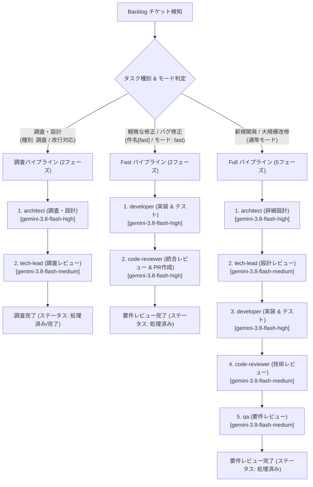

# クォータ消費最適化 & 軽量実行パイプライン仕様書

## 1. 概要と背景

`aidevflow` は Backlog の課題を検知し、自律的に専門エージェントをディスパッチしてソフトウェア開発を進める仕組みです。
初期実装において、チケット進行中に LLM の利用制限（`Individual quota reached` / 429 Rate Limit）に到達し、パイプラインが一時停止する事象が発生しました（例: STUDY-5）。

調査の結果、以下の5つの要因によりトークンおよびリクエスト枠の消費が肥大化していたことが判明しました：

1. **重量級モデル（Pro）の無指定デフォルト起動**: CLI (`agy`) 呼び出し時にモデルが明示されておらず、高コスト・低クォータ枠のモデルが全工程で使用されていた。
2. **推論エフォート（Effort）の過剰**: レビューや確認フェーズも含めて `medium` で実行され、思考トークン（Thinking tokens）が大量に消費されていた。
3. **調査タスク判定の書式制約によるフェーズ増大**: 本文の `種別\n調査`（改行区切り）がコロン必須の正規表現に合致せず、本来2フェーズ（architect → tech-lead）で完了するタスクが5フェーズ（developer → code-reviewer → qa まで）すべて実行されていた。
4. **コメント履歴の肥大化**: プロンプト注入時に、過去の AI 自身による長大な処理報告（markdown 表やコード等）がそのまま蓄積され、プロンプトの入力トークンを圧迫していた。
5. **固定5段階パイプライン**: 軽微な改修や単一ファイル修正であっても、常に5つのエージェントが順次実行されていた。

本仕様では、これらすべての課題を解決し、**クォータ消費を従来の約 1/3 〜 1/5 に削減** しつつ開発速度を大幅に向上させる最適化策を定めます。

---

## 2. 最適化アーキテクチャ

---

## 3. 具体的な改善施策

### ① モデル最適化（Pro → Flash デフォルト化 & ロール別指定）
- **環境変数**:
  - `AGY_MODEL`: デフォルト `gemini-3.8-flash-high`
  - `AGY_REVIEW_MODEL`: レビュー用モデル（オプション、デフォルト: `gemini-3.8-flash-medium`）
- **効果**:
  - Flash モデルは Pro モデルと比較してレート制限・個人クォータ枠が数倍〜十数倍広く、Quota Reached を大幅に回避。
  - レスポンス速度が Pro に比べて格段に高速化。

### ② 推論エフォート（Effort）の低減
- **設定**: `AGY_EFFORT=low` を標準化。
- **効果**:
  - 不要な長期自己検証ループを抑え、思考トークン（Thinking tokens）を半減。

### ③ 調査タスク（Investigation）判定の改行・コロン対応
- **判定ロジック強化**:
  - `種別\n調査` や `種別: 調査`、`type: investigation` 等、改行や全角・半角コロンの有無を問わず確実に「調査タスク」として検知。
- **効果**:
  - 調査タスクが誤って実装・技術レビュー・要件レビューまで走る事故を完全に防止し、2フェーズで即座に完了。

### ④ プロンプト・コメント履歴の圧縮（Context Optimization）
- **圧縮ルール**:
  1. **人間のコメント最優先**: 人間による指示・方針コメントは全文を保持。
  2. **AI 過去ログの自動要約**: AI 自身の過去の処理報告（`### [AI]` や `【レビュー依頼】`、長大な Markdown 表など）は直近の結論部分（要約）のみを抽出し、肥大化を防止。
  3. **上限文字数調整**: コメント全体の注入上限を 6,000文字から 2,500文字程度にスリム化。

### ⑤ Fast モード（軽量パイプライン: 実装 → 統合レビュー）の導入
- **トリガー**:
  - チケット件名に `[fast]` または `【fast】` が含まれる
  - チケット本文に `モード: fast` または `mode: fast` と記載されている
- **進行フロー**:
  - `developer`（実装 & コミット & PR作成） → `code-reviewer`（技術・要件統合レビュー）の 2ステップで完了。
  - 設計フェーズが不要な既知の不具合修正、文言変更、リファクタリング等のトークン消費を最小化。

### ⑥ 同時並行実行数制御 (`MAX_CONCURRENCY`) によるクォータ急激枯渇の防止
- **設定**: `MAX_CONCURRENCY=2`（デフォルト）
- **効果**:
  - `git worktree` による複数チケット並行開発時、無制限にエージェントプロセスが立ち上がると瞬間的なリクエスト集中で Rate Limit (429) や短時間でのクォータ枯渇を招きます。
  - ワーカープールによるスロット制御を行うことで、スループットとクォータ消費のバランスを最適に維持できます。
