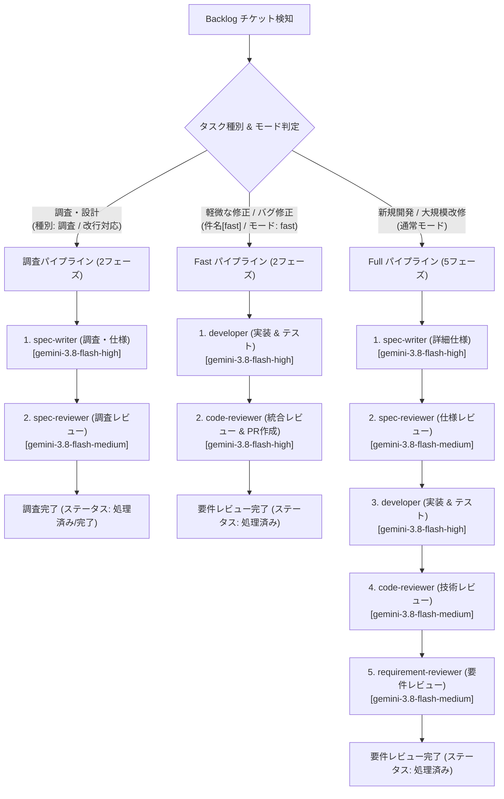
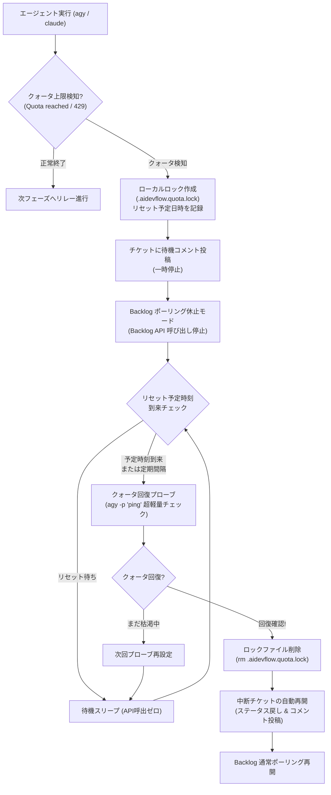

# クォータ消費最適化 & 軽量実行パイプライン仕様書

## 1. 概要と背景

`aidevflow` は Backlog の課題を検知し、自律的に専門エージェントをディスパッチしてソフトウェア開発を進める仕組みです。
初期実装において、チケット進行中に LLM の利用制限（`Individual quota reached` / 429 Rate Limit）に到達し、パイプラインが一時停止する事象が発生しました（例: STUDY-5）。

調査の結果、以下の5つの要因によりトークンおよびリクエスト枠の消費が肥大化していたことが判明しました：

1. **重量級モデル（Pro）の無指定デフォルト起動**: CLI (`agy`) 呼び出し時にモデルが明示されておらず、高コスト・低クォータ枠のモデルが全工程で使用されていた。
2. **推論エフォート（Effort）の過剰**: レビューや確認フェーズも含めて `medium` で実行され、思考トークン（Thinking tokens）が大量に消費されていた。
3. **調査タスク判定の書式制約によるフェーズ増大**: 本文の `種別\n調査`（改行区切り）がコロン必須の正規表現に合致せず、本来2フェーズ（spec-writer → spec-reviewer）で完了するタスクが5フェーズ（developer → code-reviewer → requirement-reviewer まで）すべて実行されていた。
4. **コメント履歴の肥大化**: プロンプト注入時に、過去の AI 自身による長大な処理報告（markdown 表やコード等）がそのまま蓄積され、プロンプトの入力トークンを圧迫していた。
5. **固定5段階パイプライン**: 軽微な改修や単一ファイル修正であっても、常に5つのエージェントが順次実行されていた。

本仕様では、これらすべての課題を解決し、**クォータ消費を従来の約 1/3 〜 1/5 に削減** しつつ開発速度を大幅に向上させる最適化策を定めます。

---

## 2. 最適化アーキテクチャ



---

## 3. 具体的な改善施策

### ① モデル最適化（Pro → Flash デフォルト化 & ロール別指定）
- **環境変数**:
  - `AGY_MODEL`: デフォルト `gemini-3.8-flash-high`
  - `AGY_REVIEW_MODEL`: レビュー用モデル（オプション、デフォルト: `gemini-3.8-flash-medium`）
- **効果**:
  - Flash モデルは Pro モデルと比較してレート制限・個人クォータ枠が数倍〜十数倍広く、Quota Reached を大幅に回避。
  - レスポンス速度が Pro に比べて格段に高速化。

### ② 推論エフォート（Effort）の低減
- **設定**: `AGY_EFFORT=low` を標準化。
- **効果**:
  - 不要な長期自己検証ループを抑え、思考トークン（Thinking tokens）を半減。

### ③ 調査タスク（Investigation）判定の改行・コロン対応
- **判定ロジック強化**:
  - `種別\n調査` や `種別: 調査`、`type: investigation` 等、改行や全角・半角コロンの有無を問わず確実に「調査タスク」として検知。
- **効果**:
  - 調査タスクが誤って実装・技術レビュー・要件レビューまで走る事故を完全に防止し、2フェーズで即座に完了。

### ④ プロンプト・コメント履歴の圧縮（Context Optimization）
- **圧縮ルール**:
  1. **人間のコメント最優先**: 人間による指示・方針コメントは全文を保持。
  2. **AI 過去ログの自動要約**: AI 自身の過去の処理報告（`### [AI]` や `【レビュー依頼】`、長大な Markdown 表など）は直近の結論部分（要約）のみを抽出し、肥大化を防止。
  3. **上限文字数調整**: コメント全体の注入上限を 6,000文字から 2,500文字程度にスリム化。

### ⑤ Fast モード（軽量パイプライン: 実装 → 統合レビュー）の導入
- **トリガー**:
  - チケット件名に `[fast]` または `【fast】` が含まれる
  - チケット本文に `モード: fast` または `mode: fast` と記載されている
- **進行フロー**:
  - `developer`（実装 & コミット & PR作成） → `code-reviewer`（技術・要件統合レビュー）の 2ステップで完了。
  - 設計フェーズが不要な既知の不具合修正、文言変更、リファクタリング等のトークン消費を最小化。

### ⑥ 同時並行実行数制御 (`MAX_CONCURRENCY`) によるクォータ急激枯渇の防止
- **設定**: `MAX_CONCURRENCY=2`（デフォルト）
- **効果**:
  - `git worktree` による複数チケット並行開発時、無制限にエージェントプロセスが立ち上がると瞬間的なリクエスト集中で Rate Limit (429) や短時間でのクォータ枯渇を招きます。
  - ワーカープールによるスロット制御を行うことで、スループットとクォータ消費のバランスを最適に維持できます。

---

## 4. クォータ枯渇ロック & バックログポーリング休止 & 自動回復・再開

### ① 背景と課題
どれほどモデルやプロンプトを最適化しても、大量のチケット開発や長時間の稼働により、LLM 側の個人クォータ制限（`Individual quota reached` / 429 Rate Limit）に到達する場合があります。
従来の課題：
1. **Backlog API の無駄なポーリング継続**: クォータが切れてエージェントが動けない状態でも、デーモンが Backlog へのチケット監視 API を呼び出し続けていた。
2. **別チケットの巻き込み停止**: 他に着手可能なチケットがあると、次々にエージェントを起動して即座にクォータ上限で失敗させ、すべてのチケットを「確認待ち」にしてしまっていた。
3. **人間による手動再開の負担**: クォータが回復したあと、人間が Backlog を開いてチケットステータスを「処理中」に戻す必要があった。

### ② アーキテクチャ構成と動作フロー



### ③ 主要コンポーネント

1. **クォータロックマネージャー (`QuotaLockManager` / `.aidevflow.quota.lock`)**:
   - クォータ枯渇検知時にローカルに JSON ロックファイルを作成。
   - CLI エラー文（例: `error: Individual quota reached... Resets in 2h21m6s.`）から残り時間を正規表現で自動パースし、リセット予定日時（`resetsAt`）を記録。
   - デーモン再起動時もロック状態を保持し、二重実行や無駄な API 呼び出しを防止。

2. **Backlog ポーリング休止機能 (`BacklogPoller`)**:
   - ロックファイルが存在する間、`getIssues` 等の Backlog API 呼び出しを**完全に休止**。
   - ターミナルログは 30 秒に 1 回間引き表示（`⏳ クォータ回復待機中 (リセット予定: ... / 残り 約X分)`）。
   - 他のチケットを巻き込んでクォータエラーにする事故を根本から防止。

3. **クォータ回復プローブ (`probeQuotaRecovery`)**:
   - リセット時刻が到来した際、または設定されたプローブ間隔（`QUOTA_PROBE_INTERVAL_SEC`、デフォルト 300秒 = 5分）ごとに超軽量ワンショット（`agy -p "ping"` 等）を実行。
   - 終了コード 0 かつクォータエラーなしを確認して回復を判定。

4. **全自動再開 (Auto-Resume)**:
   - クォータ回復を検知すると、ロックファイルを自動削除。
   - ロックメタデータに記録された中断チケットに対して Backlog コメントを自動投稿：
     `### 🚀【クォータ回復検知】自律処理を自動再開します`
   - ステータスを「処理中」（または担当ロールのフェーズ）に戻し、**人間の操作を一切介さずに自動で開発を再開**。
   - （※夜間や休日にクォータが切れても、リセット後に自動で開発が完了します）

5. **手動即時解除**:
   - プランをアップグレードした場合や別アカウントへ切り替えた場合は、ロックファイルを手動削除（`rm .aidevflow.quota.lock`）するだけで、即座に通常ポーリングへ復帰します。

---

## 5. トークン消費量・残量の可視化とトラッキング仕様 (`TokenUsageTracker`)

チケット並行開発時や長時間稼働時において、どの程度のリソースを消費しているか、クォータ残量やリセットまでの見込み時間を可視化する仕組みを提供します。

### ① セッション別 & 累計トークン集計 (`TokenUsageTracker`)
- **計測項目**:
  - `inputTokens`: 入力プロンプトのトークン数
  - `outputTokens`: 生成された回答トークン数
  - `thinkingTokens`: 思考モデル（Thinking / CoT）による推論思考トークン数
  - `cacheReadTokens`: プロンプトキャッシュ利用トークン数
  - `totalTokens`: 1セッションあたりの合計消費トークン数
  - `sessionCount`: デーモンプロセス起動後のエージェント実行回数
- **集計方式**:
  - Antigravity CLI (`agy`) の `stream-json` 出力に含まれる `result.usage` を自動解析。
  - プロセス常駐メモリ（`TokenUsageTracker`）にて、チケット並行開発下でもスレッドセーフに累積トークン数を加算集計。

### ② ログおよび Backlog コメントへの出力形式
1. **コンソール標準出力**:
   ```
   [AgyRunner] code-reviewer エージェント終了 (終了コード: 0, 所要時間: 42秒)
   [AgyRunner] セッション消費: 入力 8,420 / 出力 1,230 (思考 410) / 合計 9,650 tokens
   [TokenUsageTracker] [トークン累積消費] セッション数: 3回 | 入力: 24,100 | 出力: 3,450 (思考: 1,120) | キャッシュ読込: 0 | 合計: 27,550 tokens
   ```
2. **構造化ログ (`logs/aidevflow.jsonl`)**:
   - イベント `agent_finish` に `usage` および `cumulativeTokens` を記録。
3. **Backlog コメント**:
   - 各フェーズの処理報告に `**トークン消費量**: 入力: X / 出力: Y (思考: Z) / 合計: W tokens` を記載。
   - 全工程完了時には最終フェーズ消費トークンに加え、`累計トークン消費 (全セッション計)` を明記。
4. **クォータ待機ログへの残量・リセット時間表示**:
   - クォータ枯渇時、残りのリセット待機時間および直前までの累積トークン消費量を明示：
   ```
   [Poller] ⏳ クォータ回復待機中 (リセット予定: 2026-09-12T02:30:00.000Z / 残り 約45分) [累計消費: 128,500 tokens (8回)]。Backlog ポーリング休止中...
   ```

---

## 6. 全工程完了時の人間受入確認手順 & コマンド案内仕様

AI エージェントによる全工程（通常 5 フェーズ、または Fast モード統合レビュー）が完了した際、Backlog の完了通知コメントに、人間がローカル環境で要件が正しく実装されたかを迅速かつ確実に受入確認できるよう、具体的な実行コマンドと手順を自動案内します。

### ① 自動生成される確認手順（5ステップ）

1. **作業 Worktree への移動 & 最新コードの同期**:
   - 複数リポジトリ構成の場合は各リポジトリの Worktree パスを自動展開。
   ```bash
   cd <worktreeDir>
   git pull origin "<issueKey>"
   git log -n 5 --oneline
   ```
2. **変更差分の確認**:
   ```bash
   git diff origin/main..HEAD --stat
   ```
3. **自動テスト & ビルドの検証**:
   - リポジトリ内の構成ファイル（`package.json`, `Cargo.toml`, `go.mod`, `pytest` 等）を自動検知して最適なテストコマンドを提示。
   ```bash
   pnpm test
   pnpm build
   ```
4. **ローカル環境での動作確認 & 要件受入ポイント**:
   - 開発サーバー起動コマンド（`pnpm dev`, `docker compose up` 等）を案内し、チケットに記載された要件（新機能、UI表示、APIレスポンス等）の受入確認ポイントを提示。
5. **確認完了後の対応アクション**:
   - **【要件通りで問題ない場合 (完了・マージ)】**:
     1. GitHub 上でプルリクエストをマージ。
     2. 本チケットのステータスを **「完了」** に変更。
   - **【修正や追加要望がある場合 (AIに再修正させる)】**:
     1. 本チケットのコメント欄に具体的な修正指示・指摘を記入。
     2. ステータスを **「処理中」** に変更（AI エージェント `developer` が自動検知し、修正コミットを作成して PR に追記 push します）。

